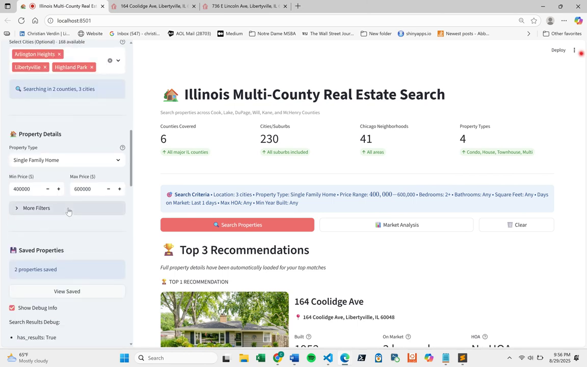
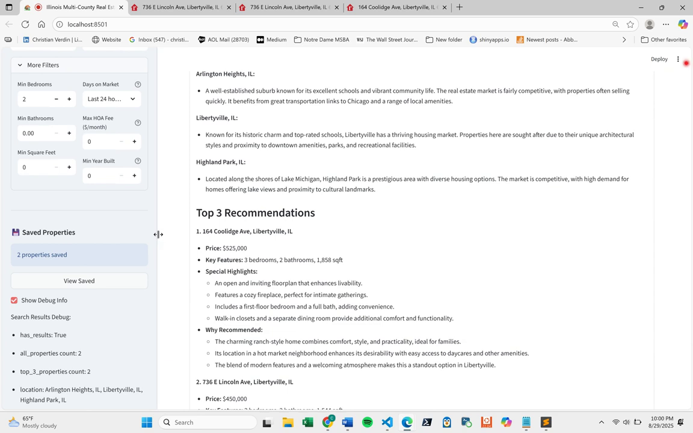
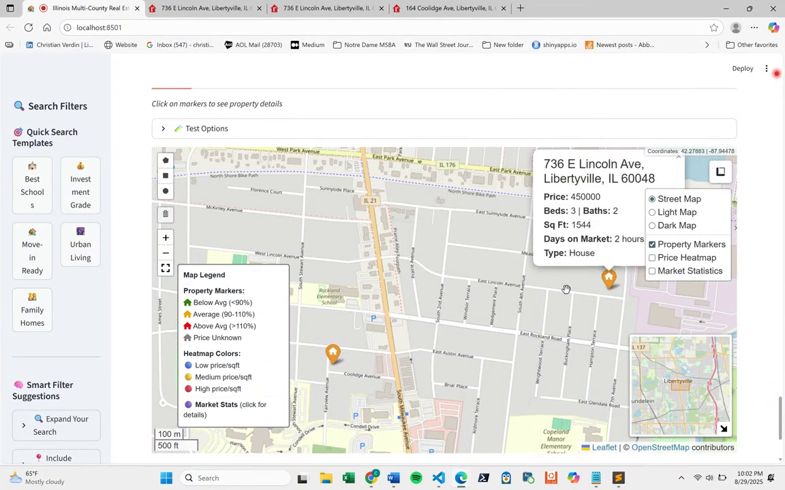
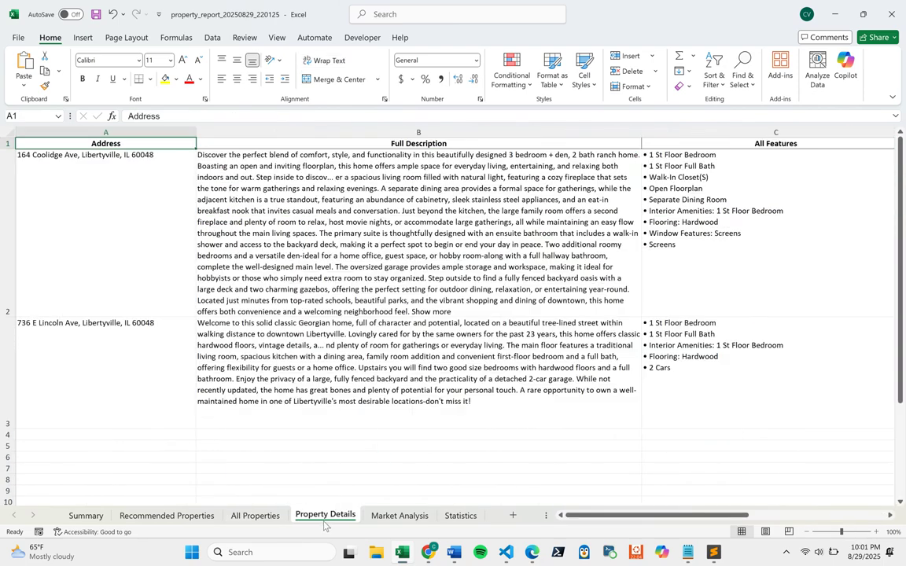

# Hi there, I'm Christian Verdin

**Data Scientist & Full-Stack Engineer** with 7+ years of experience designing, developing, and delivering end-to-end data science, ML, and AI solutions that drive real business impact.

I build production-grade applications that integrate LLMs, real-time data pipelines, and modern web frameworks to solve complex analytical problems.

[](https://www.linkedin.com/in/christian-verdin/)
[](mailto:christiandverdin@gmail.com)
[](https://dailylocks.ai)
[](https://medium.com/@cver123/about)

---

## Featured Project

### NFL Analytics Engine
**Sports Betting Analytics & Visualization Platform**

A comprehensive analytics system for NFL betting intelligence, processing **282+ games**, **14,800+ player-quarter records**, and **1,446 TD events** for the 2025 season. Features automated matchup reports, real-time visualization generation, and multi-tier betting edge detection through the Conference Championship round.

<p align="center">
  
</p>

<details>
<summary><b>View More Screenshots</b></summary>
<br>
<p align="center">
  
</p>
<p align="center">
  
</p>
<p align="center">
  
</p>
<p align="center">
  
</p>
</details>

**Key Capabilities:**
- **Matchup Intelligence System** — Generates 14-page reports per game with player trends, red zone efficiency, and situational analysis across 116 matchup reports
- **Quarter-by-Quarter Tracking** — 1,446 TD events and 14,847 player stat records with Q1-Q4 breakdowns for live betting insights
- **Visualization Engine** — 21 custom playoff visualizations including skill position dashboards, TD probability gauges, and clutch performer analysis
- **Playoff Scenario Simulator** — Win/loss impact modeling for seeding scenarios with elimination risk detection
- **Injury Context Analysis** — Distinguishes "injury beneficiaries" from "organic risers" for sustainable prop betting

**Sample Outputs:**
- [Skill Position Matchups Dashboard](./assets/nfl_analytics/20_skill_position_matchups.png) — 6-panel analysis: TD leaders, quarter scoring patterns, RB comparisons, clutch performers, receiving threats, and scoring consistency
- [Conference Championship Visualizations](https://github.com/ChristianVerdin/nfl_analytics/tree/main/outputs/reports/conference_championship_2025) — 21 betting-focused graphics for AFC/NFC title games
- [Weekly Matchup Reports](https://github.com/ChristianVerdin/nfl_analytics/tree/main/outputs/reports/matchups) — 8 weeks of detailed game intelligence (Wild Card through Conference Championship)

**Technical Highlights:**
- **Data Pipeline:** R-based ETL processing 500+ metrics per game via nflreadr API with SQLite persistence
- **Statistical Modeling:** EPA calculations, efficiency matrices, player trend detection (20%+ usage changes)
- **Visualization:** ggplot2 with custom `theme_nfl_playoff()`, multi-panel dashboards via gridExtra
- **Database:** 9 core tables + 5 quarter-level tracking tables with parameterized query wrappers
- **Automation:** Batch game analysis processing 14 games in parallel with `analyze_week_matchups.sh`

**Built With:**

`R` `tidyverse` `ggplot2` `SQLite` `nflreadr` `gridExtra` `Cairo`

[View Repository →](https://github.com/ChristianVerdin/nfl_analytics)

---

### NCAAB Analytics
**College Basketball Prediction System** | *76.3% prediction accuracy*

A production-grade analytics pipeline for NCAA Men's Basketball that combines possession-based efficiency metrics with real-time betting market data to generate daily game predictions and value opportunities.

<p align="center">
  
  
  
</p>

<p align="center">
  
</p>

<details>
<summary><b>View Sample Output</b></summary>
<br>

```
══════════════════════════════════════════════════════════════════════
 STRONG BET PICKS (70%+ Confidence)
══════════════════════════════════════════════════════════════════════

  1. Louisiana Ragin' Cajuns @ App State Mountaineers
     Pick: App State Mountaineers (95% confidence)
     Bet Type: MONEYLINE → TAKE_MONEYLINE

  2. Niagara Purple Eagles @ Fairfield Stags
     Pick: Fairfield Stags (95% confidence)
     Vegas: Spread -10.5 | ML: -800/490
     Bet Type: MONEYLINE_JUICED → SMALL_ML_BET

══════════════════════════════════════════════════════════════════════
 UNDERDOG VALUE PLAYS
══════════════════════════════════════════════════════════════════════

  → South Alabama Jaguars (77%)
    vs James Madison Dukes
    Vegas: +4.5 spread | ML +160
```

</details>

**Key Capabilities:**
- Possession-based efficiency metrics (KenPom-style) normalized per 100 possessions
- Iterative strength of schedule using Colley-like algorithm (10 iterations)
- Volatility detection identifying high-variance matchups for live betting
- Confidence calibration achieving 0.1801 Brier score (excellent)
- Real-time Vegas odds integration with spread value detection

**Technical Highlights:**
- **Data Pipeline:** R-based ETL processing 728 teams and 5,900+ games with incremental updates
- **Statistical Modeling:** Four-factor analysis, adaptive recency weighting (14-day half-life)
- **Prediction Engine:** Win probability calibration validated against historical performance
- **Database:** SQLite with optimized schema for analytical queries
- **Agent Integration:** Python interface syncing daily predictions to conversational AI

**Performance Metrics:**

| Metric | Result |
|--------|--------|
| Overall Accuracy | 76.3% (971/1,273 games) |
| STRONG_BET Picks | 80.8% accuracy |
| VERY_HIGH Tier | 82.4% accuracy |

**Built With:**

`R` `Python` `SQLite` `Pandas` `Statistical Modeling` `The Odds API`

---

### AI Real Estate System
**Multi-Platform Property Aggregation & Analysis**

A full-stack application that aggregates real estate listings from 5 major platforms (Zillow, Redfin, Trulia, Realtor.com, Homes.com), applying AI-powered extraction to deliver unified property data with interactive mapping and investment analytics.

<p align="center">
  
</p>

<details>
<summary><b>View More Screenshots</b></summary>
<br>
<p align="center">
  
</p>
<p align="center">
  
</p>
<p align="center">
  
</p>
</details>

**Key Features:**
- Multi-platform data aggregation from 5 real estate websites
- AI-powered property extraction using Firecrawl + OpenAI GPT
- Three-tier caching system (Memory -> Redis -> SQLite)
- Interactive mapping with geocoded property locations
- Investment analytics with ROI and cap rate calculations

**Technical Highlights:**
- **Frontend:** Streamlit with custom components, Plotly visualizations
- **Backend:** Python with async HTTP clients, circuit breaker pattern
- **AI/ML:** OpenAI GPT for intelligent data extraction and normalization
- **Caching:** Multi-tier LRU cache with 65-70% hit rate optimization
- **Data:** Pydantic schemas, pandas processing, multi-format exports

**Built With:**

`Python` `Streamlit` `OpenAI API` `Firecrawl` `Redis` `SQLite` `Pandas` `Folium` `Plotly`

---

### Daily Locks AI
**Production SaaS Platform with LLM-Powered Analytics**

A full-stack application featuring agentic AI that processes natural language queries against 15,000+ historical records, delivering structured insights with confidence scoring and real-time streaming responses.

**Live:** [dailylocks.ai](https://dailylocks.ai)

<p align="center">
  
</p>

<details>
<summary><b>View More Screenshots</b></summary>
<br>
<p align="center">
  
</p>
<p align="center">
  
</p>
<p align="center">
  
</p>
</details>

**Key Features:**
- Natural language interface with context-aware prompt engineering
- Multi-model LLM routing (Claude Haiku/Sonnet/Opus) based on user tier
- Real-time streaming responses with Server-Sent Events
- Subscription management with Stripe Checkout & Customer Portal
- Persistent conversation history with full-text search

**Architecture & Technical Highlights:**
- **Frontend:** Next.js 15 App Router, React 19, TypeScript, Zustand state management
- **Backend:** FastAPI with async endpoints, intelligent agent routing system
- **AI/ML:** Anthropic Claude API, dynamic prompt construction, context windowing
- **Database:** Supabase (PostgreSQL) with Row-Level Security, real-time subscriptions
- **Auth:** JWT-based authentication with protected API routes
- **Payments:** Stripe integration (checkout sessions, webhooks, customer portal)
- **Data Pipeline:** Automated ETL processing 500+ records weekly via Playwright
- **Testing:** 116 automated tests with pytest

**Built With:**

`Next.js 15` `React 19` `TypeScript` `FastAPI` `Python` `Claude API` `Supabase` `Stripe` `Tailwind CSS` `Zustand` `Playwright`

---

## Technical Skills

<table>
<tr>
<td valign="top" width="33%">

### Languages


</td>
<td valign="top" width="33%">

### Frontend


</td>
<td valign="top" width="33%">

### Backend & Data


</td>
</tr>
<tr>
<td valign="top" width="33%">

### AI & ML


</td>
<td valign="top" width="33%">

### Infrastructure


</td>
<td valign="top" width="33%">

### Tools


</td>
</tr>
</table>

---

## Let's Connect

I'm always open to collaborating on projects together so feel free to reach out!

<p align="center">
  <a href="https://www.linkedin.com/in/christian-verdin/"></a>
  <a href="https://github.com/ChristianVerdin"></a>
  <a href="https://medium.com/@cver123/about"></a>
</p>

<p align="center">
  <i>Open to opportunities in AI/ML engineering, full-stack development, and data-intensive applications.</i>
</p>

<p align="center">
  <a href="mailto:christiandverdin@gmail.com">christiandverdin@gmail.com</a>
</p>

---
