# Hi there, I'm Christian Verdin

**Senior Data Scientist & AI/ML Engineer** with 7+ years of experience designing, developing, and deploying end-to-end ML/AI systems — from data pipelines and production models to complete applications that drive real business impact.

I build production-grade systems that integrate LLMs, real-time data pipelines, and modern web frameworks to solve complex analytical problems.

[](https://www.linkedin.com/in/christian-verdin/)
[](mailto:christiandverdin@gmail.com)
[](https://dailylocks.ai)
[](https://medium.com/@cver123/about)

---

## Projects at a Glance

<table>
<tr>
<td align="center" width="25%">
<a href="#lakeshoreiq---illinois-real-estate-intelligence">

</a>
<br/>
<sub><b>Property Intelligence Platform</b></sub>
<br/>
<sub>10 data sources • Live SaaS</sub>
<br/>
<code>Next.js</code> <code>FastAPI</code> <code>Supabase</code>
</td>
<td align="center" width="25%">
<a href="#nfl-analytics-engine">

</a>
<br/>
<sub><b>Statistical Intelligence</b></sub>
<br/>
<sub>285 games • Season Complete ✅</sub>
<br/>
<code>R</code> <code>ggplot2</code> <code>SQLite</code>
</td>
<td align="center" width="25%">
<a href="#daily-locks-ai">

</a>
<br/>
<sub><b>AI Betting Intelligence</b></sub>
<br/>
<sub>Live at dailylocks.ai • 7 pages</sub>
<br/>
<code>Next.js</code> <code>Claude</code> <code>ESPN API</code>
</td>
<td align="center" width="25%">
<a href="#ncaab-analytics">

</a>
<br/>
<sub><b>Prediction System</b></sub>
<br/>
<sub>68.8% live • 88.3% STRONG_BET</sub>
<br/>
<code>R</code> <code>Python</code> <code>The Odds API</code>
</td>
</tr>
</table>

<p align="center">


</p>

---

## Featured Projects

### LakeshoreIQ - Illinois Real Estate Intelligence
**Full-Stack Property Search, Valuation & Market Analysis Platform**

A production SaaS application aggregating **10 real-time data sources** to deliver property search, automated valuations, market analysis, and neighborhood intelligence across Illinois. Integrates census demographics, school quality ratings, crime statistics, development activity tracking, and economic indicators into a unified property analysis experience.

**Live:** [lakeshoreiq.com](https://lakeshoreiq.com)

<p align="center">
  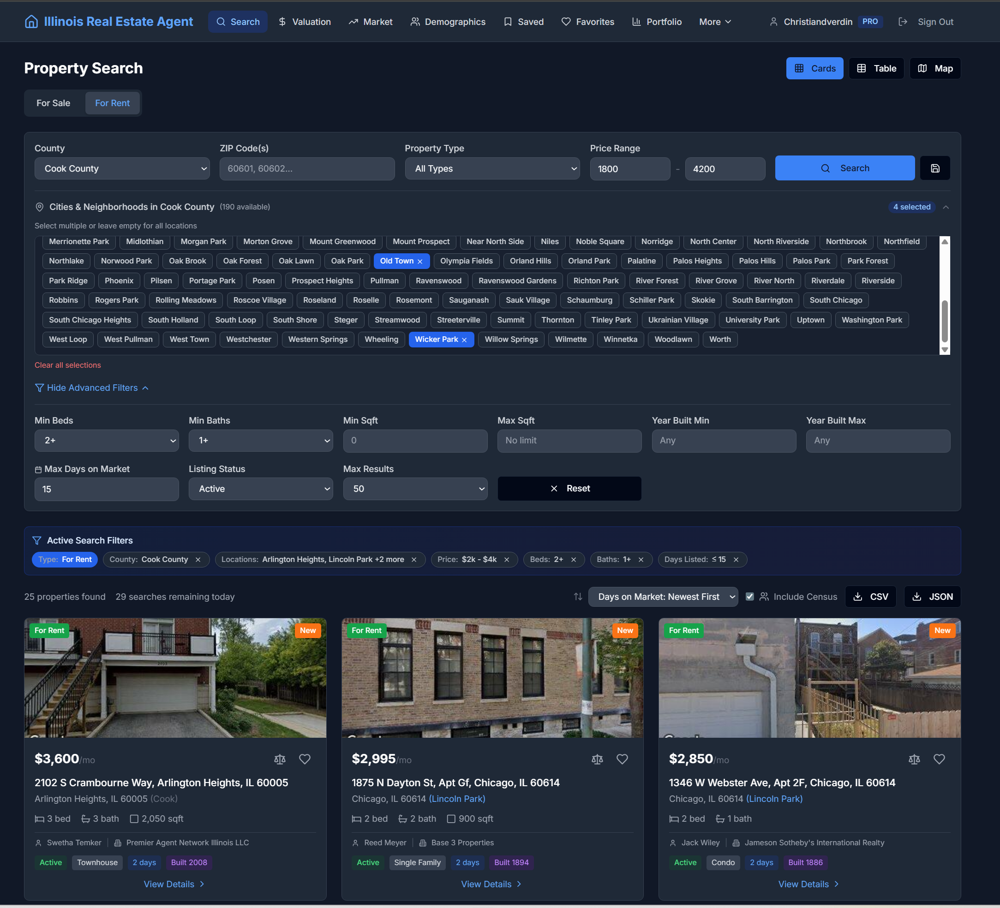
</p>

<details>
<summary><b>View More Screenshots</b></summary>
<br>
<p align="center">
  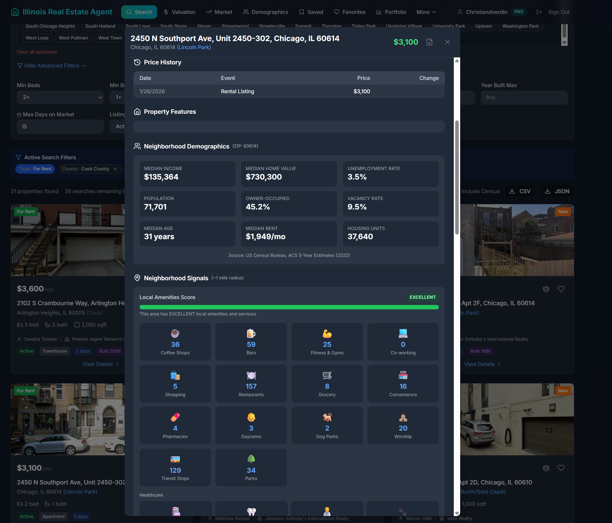
</p>
<p align="center">
  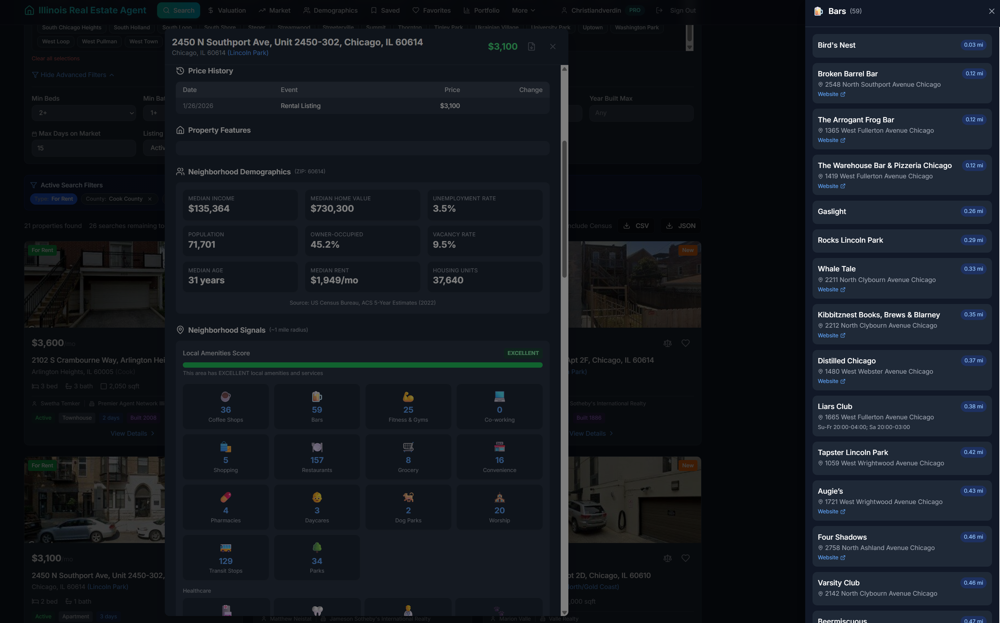
</p>
<p align="center">
  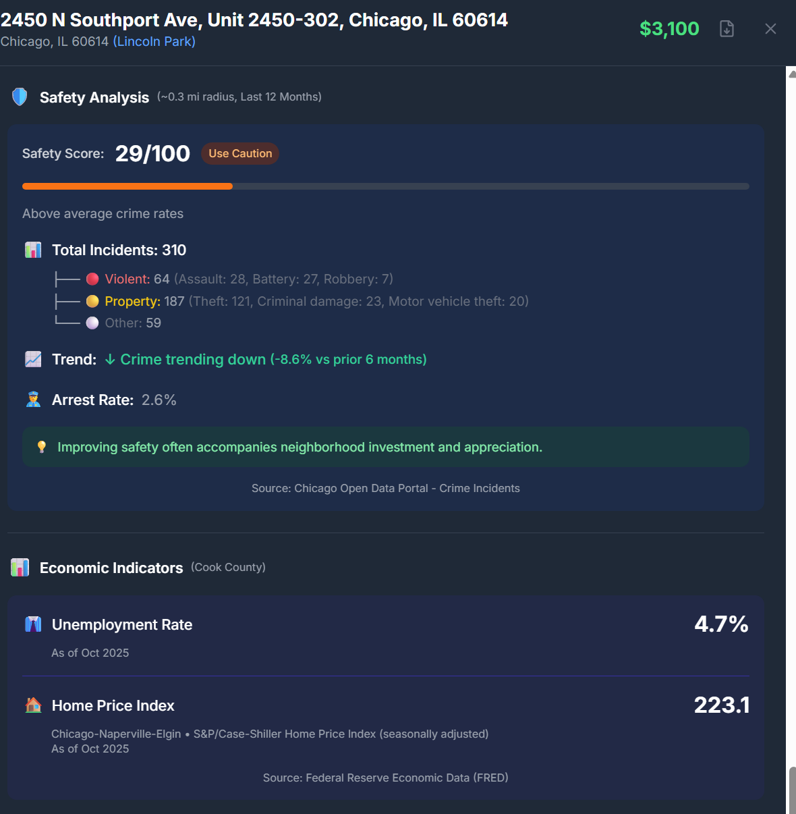
</p>
<p align="center">
  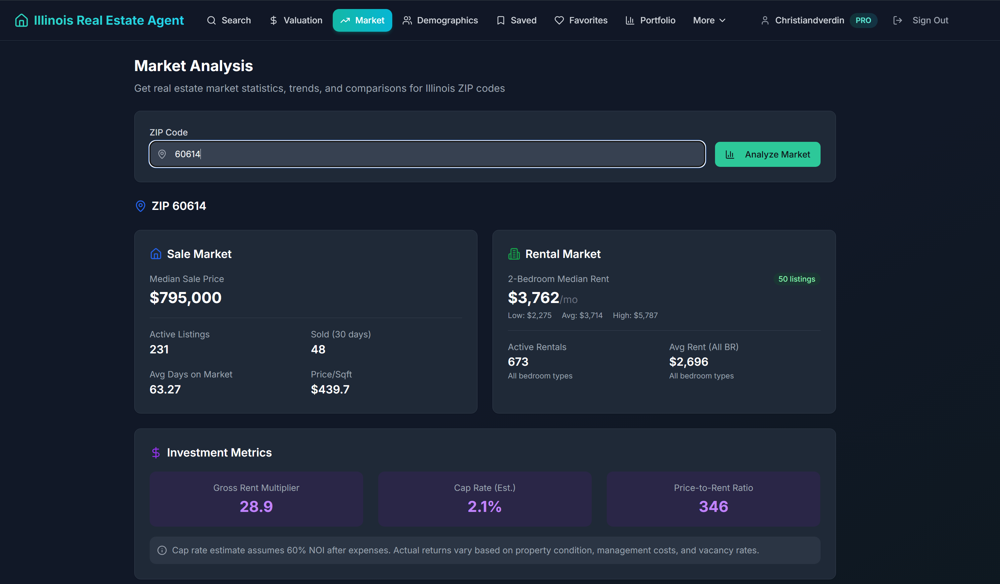
</p>
<p align="center">
  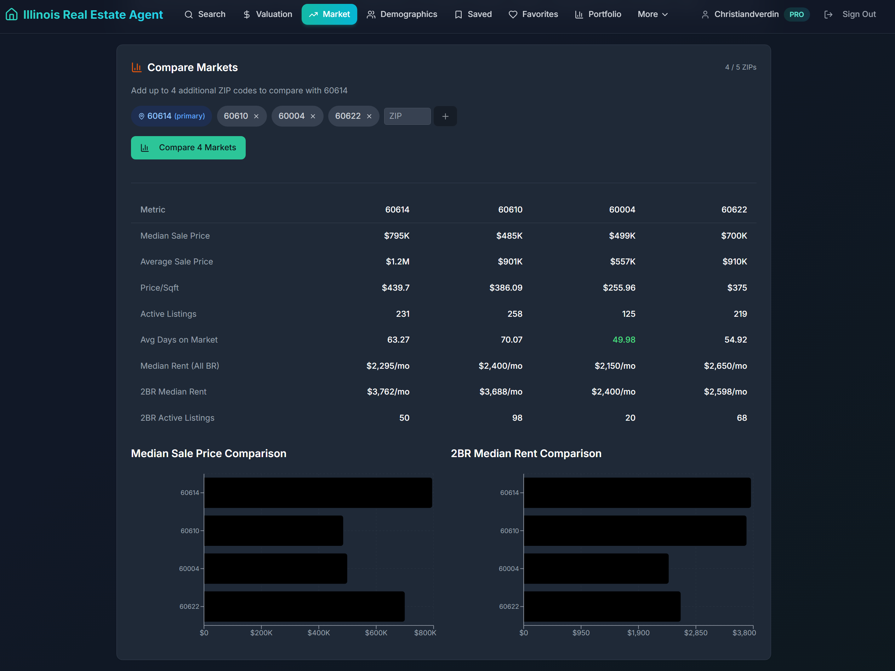
</p>
<p align="center">
  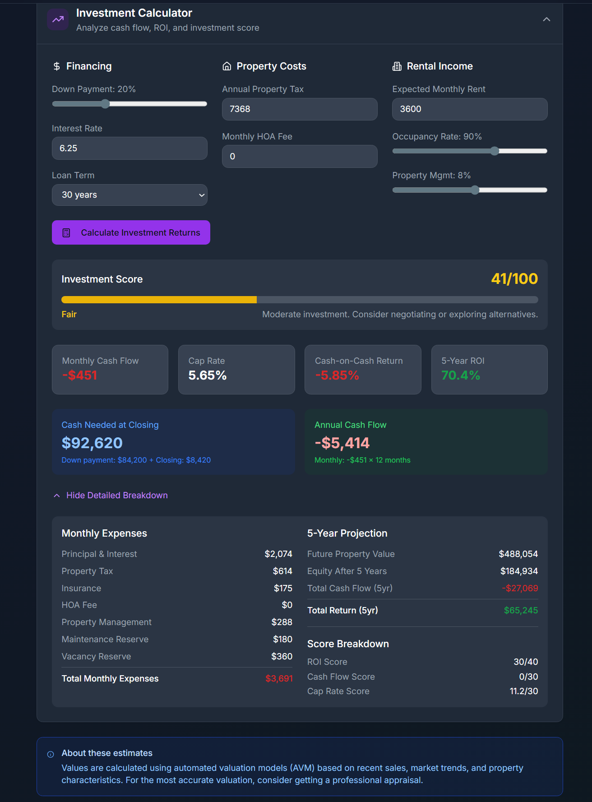
</p>
<p align="center">
  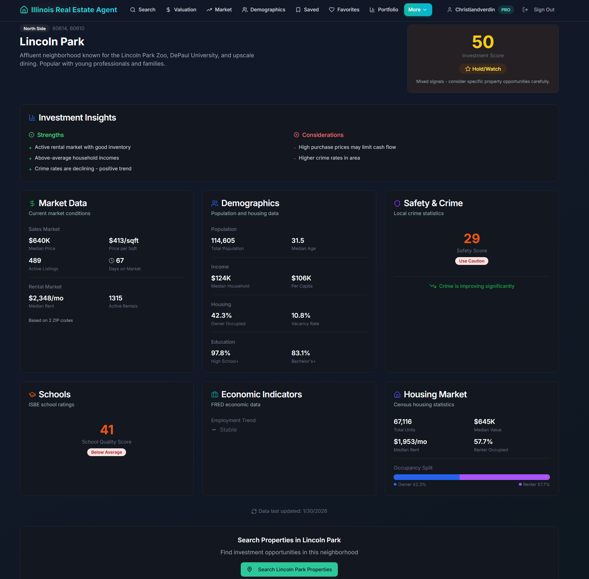
</p>
<p align="center">
  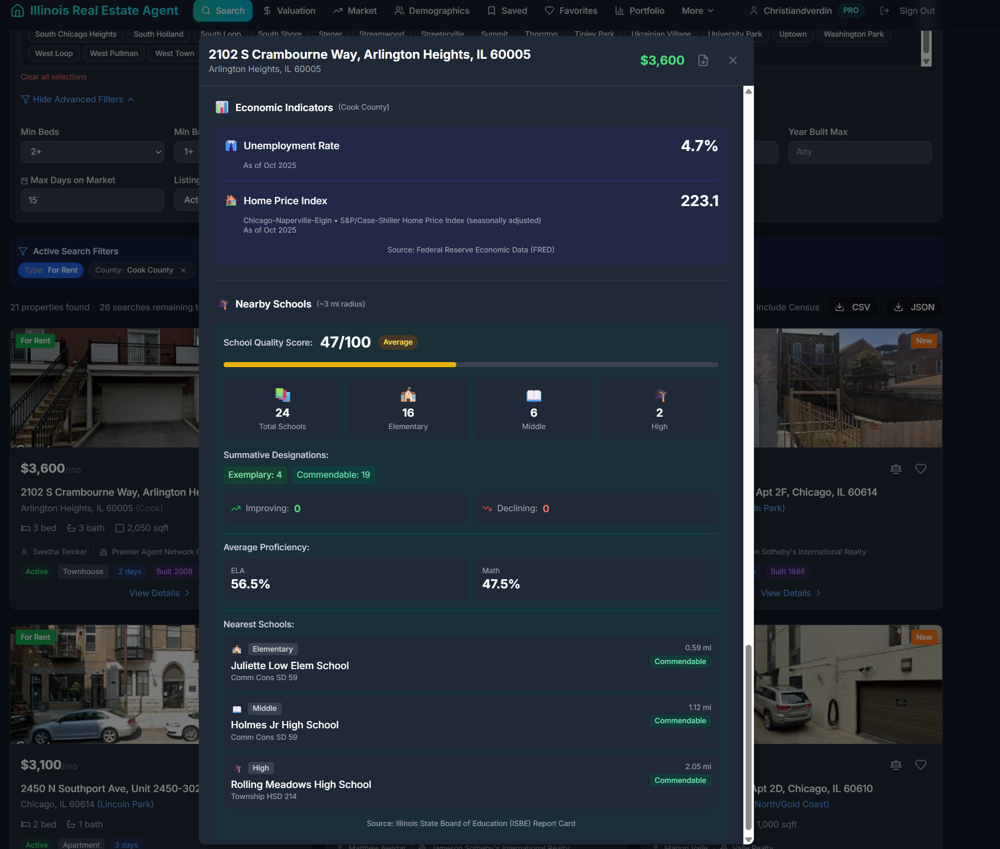
</p>
</details>

**Key Capabilities:**
- **Property Search Engine** — Filters by county, city, 50+ Chicago neighborhoods, property type, price, beds/baths, sqft, year built, and days on market with Street View imagery and listing photos
- **Automated Valuations** — RentCast AVM with confidence scoring, rent estimates with comparable analysis, and a full investment calculator (cash flow, cap rate, cash-on-cash return, 5-year ROI projection)
- **Market Analysis** — ZIP-level sale and rental metrics with 2BR rental stats computed from active listings; side-by-side comparison of up to 5 ZIP codes
- **Neighborhood Intelligence** — 28-category amenity scoring via OpenStreetMap, walkability proxy, and drilldown into specific amenity types within configurable radius
- **Crime & Safety Analysis** — Chicago crime data with safety scoring (0-100), violent/property breakdown, arrest rates, and 6-month trend detection (Chicago only, Socrata API)
- **Development Activity Tracking** — Building permits, business licenses, and liquor licenses scored into a development activity index with investment breakdowns (Chicago only)
- **School Quality Ratings** — 5,112 Illinois schools with ISBE Report Card data, geocoded locations, proficiency trends, and quality scoring by designation
- **Economic Indicators** — County unemployment rates and Chicago metro home price index via FRED API with year-over-year trend analysis
- **Census Demographics** — ZIP-level population, income, housing, employment, and education data from the U.S. Census Bureau
- **SaaS Monetization** — Three-tier subscription model (Free / Starter $9.99/mo / Pro $24.99/mo) with Stripe Checkout, usage metering, and feature gating

**Architecture & Technical Highlights:**
- **Frontend:** Next.js 15 App Router, React 19, TypeScript, Tailwind CSS, shadcn/ui, Zustand, Recharts
- **Backend:** FastAPI with async endpoints, 10 service modules, Redis caching (Upstash), Pydantic validation
- **Database:** Supabase (PostgreSQL) with Row-Level Security, plus SQLite for ISBE school data (5,112 schools, 94% geocoded)
- **Auth:** Supabase Auth with JWT validation, protected API routes, email verification
- **Payments:** Stripe integration (checkout sessions, webhooks, customer portal, usage enforcement)
- **Data Sources:** RentCast API, U.S. Census Bureau, OpenStreetMap Overpass, Chicago Open Data Portal (3 datasets), FRED API, ISBE Report Card, Google Street View, Google Analytics 4
- **Geocoding:** Census Batch Geocoder (primary) + Nominatim fallback for school location resolution
- **Caching Strategy:** Redis with tiered TTLs — 1hr (property), 1 day (crime/permits), 7 days (amenities/FRED), 30 days (schools), 1 year (census)
- **Deployment:** Vercel (frontend, auto-deploy from main) + Railway (backend) with environment-based configuration

**Built With:**

`Next.js 15` `React 19` `TypeScript` `FastAPI` `Python` `Supabase` `PostgreSQL` `Redis` `Stripe` `Tailwind CSS` `shadcn/ui` `Zustand` `Recharts` `SQLite` `Google Street View API`

[View Repository →](https://github.com/ChristianVerdin/illinois-real-estate)

---

### NFL Analytics Engine
**Statistical Intelligence & Visualization Platform** | *2025-26 Season Complete ✅*

A comprehensive analytics system for NFL game prediction, processing **285 games**, **14,900+ player-quarter records**, **22,700+ snap counts**, and **1,455 TD events** through Super Bowl LX (SEA 29, NE 13). Features automated matchup reports, real-time visualization generation, and predictive pattern recognition with **18,900+ historical game outcomes** analyzed.

<p align="center">
  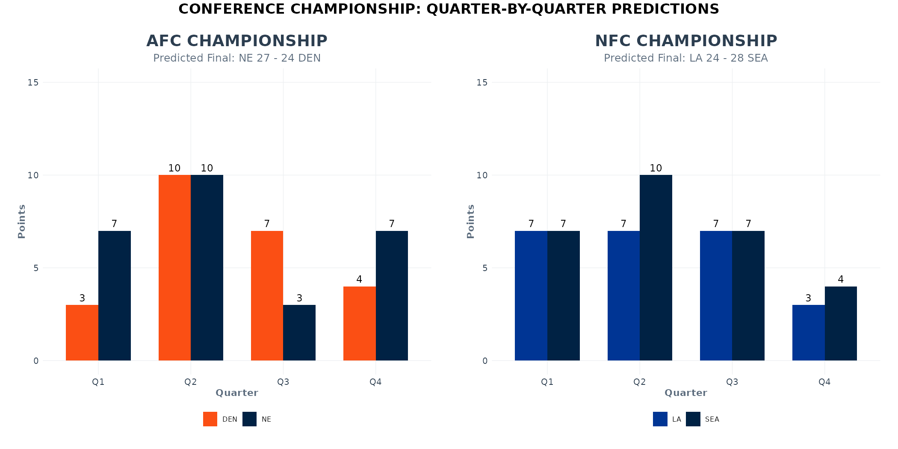
</p>

<p align="center">
  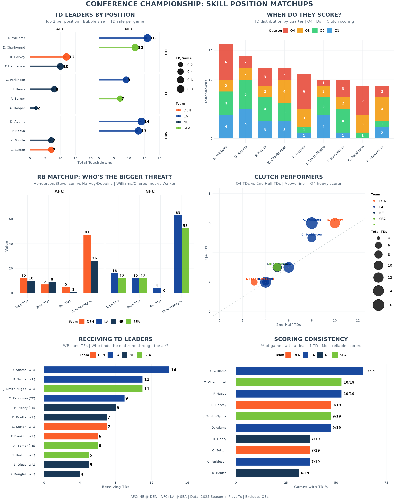
</p>

<details>
<summary><b>View More Screenshots</b></summary>
<br>
<p align="center">
  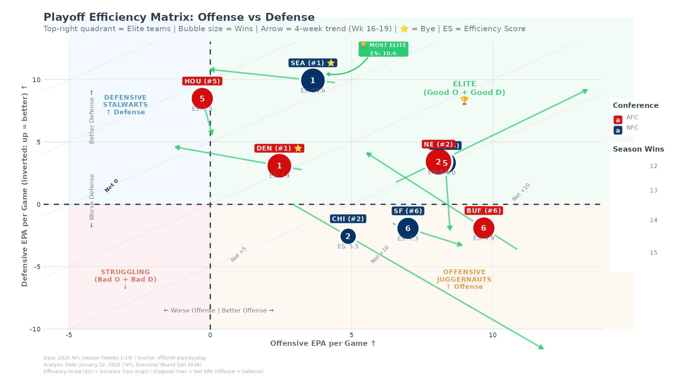
</p>
<p align="center">
  
</p>
<p align="center">
  
</p>
<p align="center">
  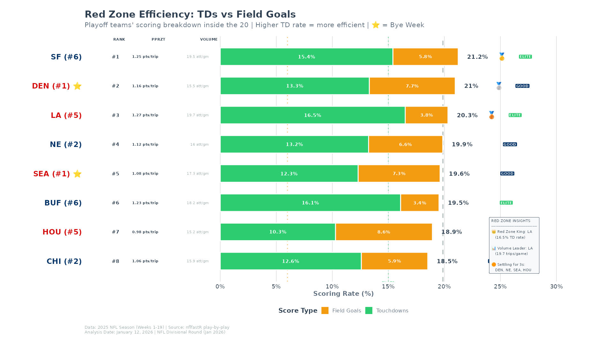
</p>
</details>

**Key Capabilities:**
- **Matchup Intelligence System** — Generates 14-page reports per game with player trends, red zone efficiency, and situational analysis across 116+ matchup reports
- **Quarter-by-Quarter Tracking** — 1,455 TD events and 14,900+ player stat records with Q1-Q4 breakdowns for granular performance analysis
- **Visualization Engine** — 21 custom playoff visualizations including skill position dashboards, TD probability gauges, and clutch performer analysis
- **Playoff Scenario Simulator** — Win/loss impact modeling for seeding scenarios with elimination risk detection
- **Player Trend Analysis** — Distinguishes usage pattern changes and identifies breakout performers with 20%+ usage increases

**Sample Outputs:**
- [Skill Position Matchups Dashboard](./assets/nfl_analytics/20_skill_position_matchups.png) — 6-panel analysis: TD leaders, quarter scoring patterns, RB comparisons, clutch performers, receiving threats, and scoring consistency
- [Super Bowl LX Visualizations](https://github.com/ChristianVerdin/nfl_analytics/tree/main/outputs/reports) — Complete playoff graphics from Wild Card through Super Bowl
- [Weekly Matchup Reports](https://github.com/ChristianVerdin/nfl_analytics/tree/main/outputs/reports/matchups) — Detailed game intelligence for every playoff round

**Technical Highlights:**
- **Data Pipeline:** R-based ETL processing 500+ metrics per game via nflreadr API with SQLite persistence
- **Statistical Modeling:** EPA calculations, efficiency matrices, player trend detection (20%+ usage changes)
- **Visualization:** ggplot2 with custom `theme_nfl_playoff()`, multi-panel dashboards via gridExtra
- **Database:** 9 core tables + 5 quarter-level tracking tables with parameterized query wrappers
- **Automation:** Batch game analysis processing 14 games in parallel with `analyze_week_matchups.sh`

**Built With:**

`R` `tidyverse` `ggplot2` `SQLite` `nflreadr` `gridExtra` `Cairo`

[View Repository →](https://github.com/ChristianVerdin/nfl_analytics)

---

### Daily Locks AI
**Multi-Sport AI Agent with LLM-Powered Analytics**

A full-stack application featuring an agentic AI system that processes natural language queries against **18,900+ historical NFL outcomes** and **730 NCAAB teams / 5,400+ games**. Features 7 dedicated analysis pages, real-time ESPN live score monitoring, and a proprietary second-half scoring model. Delivers confidence-calibrated predictions with 68.8% live accuracy (88.3% on STRONG_BET tier).

**Live:** [dailylocks.ai](https://dailylocks.ai)

<p align="center">
  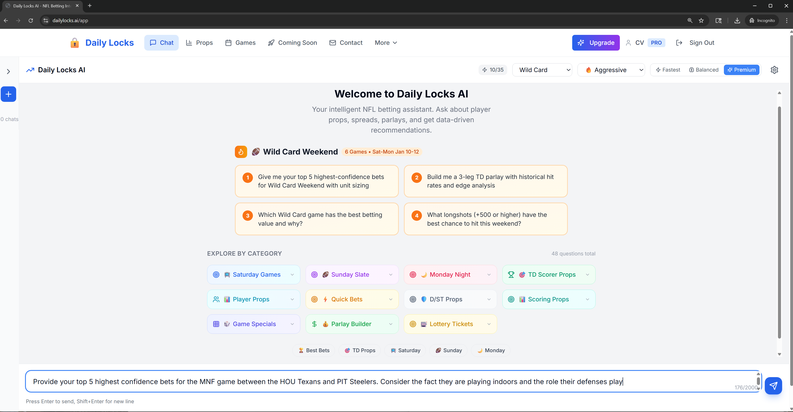
</p>

<details>
<summary><b>View More Screenshots</b></summary>
<br>
<p align="center">
  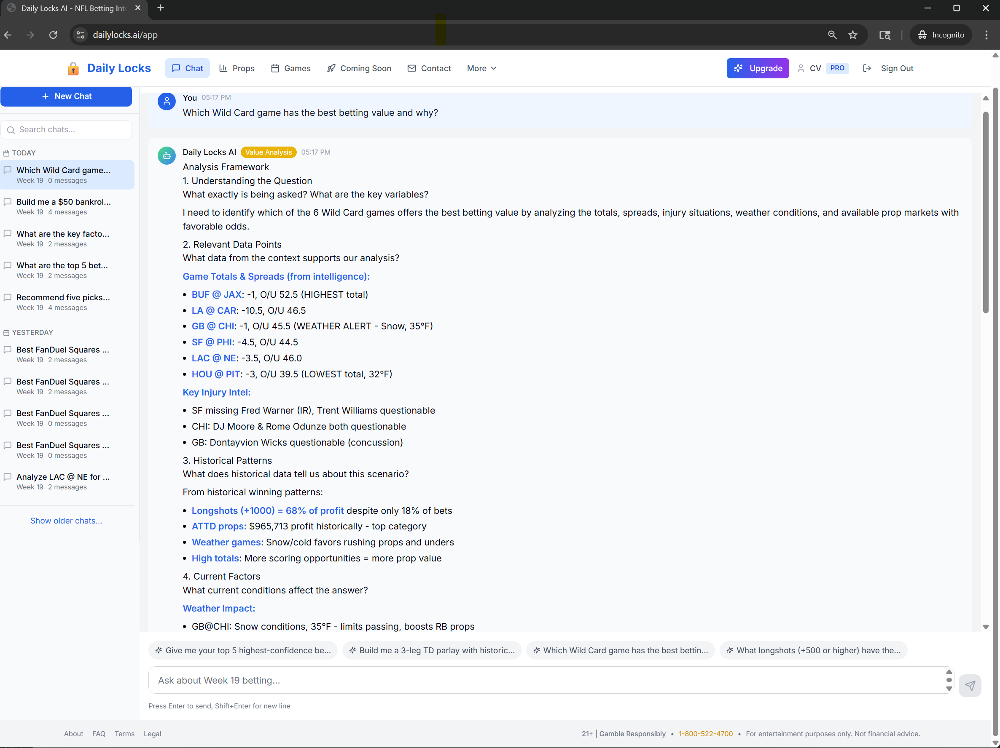
</p>
<p align="center">
  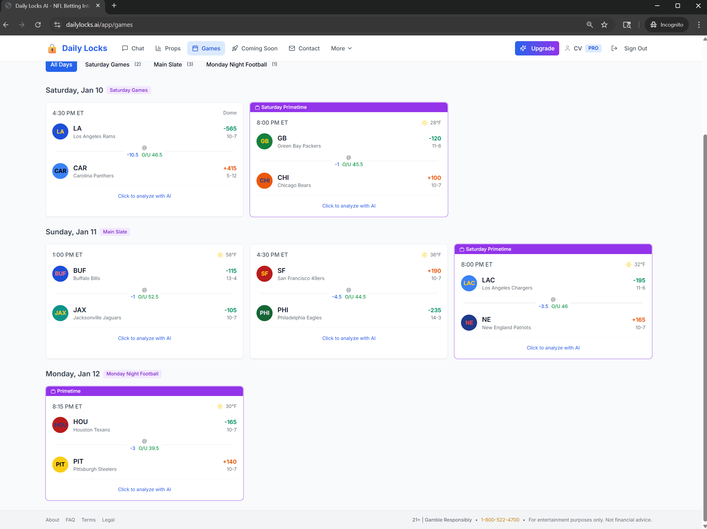
</p>
<p align="center">
  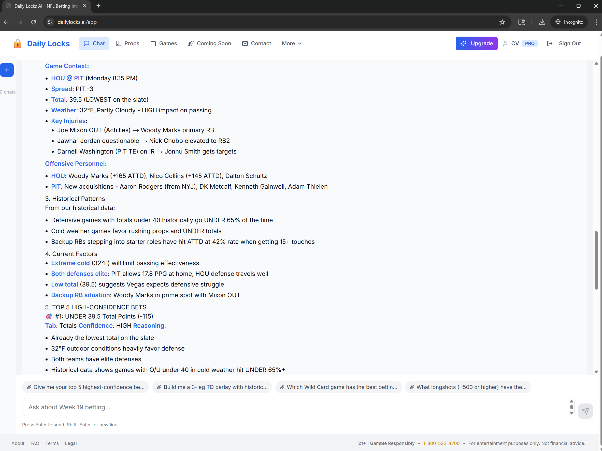
</p>
</details>

**Key Features:**
- **Multi-Sport Detection** — Automatic routing between NFL (archived) and NCAAB analysis based on query context
- **7 Analysis Pages** — Matchups, Picks, H2 Unders, Race-To Props, Live Scores, Tournament Bracket, NFL Archive
- **NCAAB Predictions** — 730 teams with KenPom-style efficiency metrics, daily automated predictions, and +EV edge calculations
- **Live Score Monitoring** — Real-time ESPN API integration with dynamic recommendation adjustments based on game state (pre-game, H1, halftime, final)
- **H2 Under Model** — Proprietary second-half scoring analysis with PRIME/STRONG/LEAN tiers and Vegas line comparison
- **Race-To Props** — Race-to-30/35 second-half scoring props with breakeven odds and dual elite defense detection
- **Confidence Calibration** — 68.8% live accuracy overall, 88.3% on STRONG_BET tier picks
- **Natural Language Interface** — Context-aware prompt engineering with multi-model LLM routing (Claude Haiku/Sonnet/Opus)
- **March Madness Ready** — Cinderella scoring, seed matchup history (2010-2025), bracket path analysis

**Architecture & Technical Highlights:**
- **Frontend:** Next.js 15 App Router, React 19, TypeScript, Zustand state management, Vercel Analytics
- **Backend:** FastAPI with async endpoints, intelligent agent routing system, Redis caching (Railway)
- **AI/ML:** Anthropic Claude API, dynamic prompt construction, context windowing, sport-specific handler bypass ($0 cost NCAAB queries)
- **Live Data:** ESPN public API integration, 60-second polling, game_id matching between ESPN and prediction CSVs
- **Database:** Supabase (PostgreSQL) with Row-Level Security, real-time subscriptions
- **Auth:** JWT-based authentication with auto-refresh token handling
- **Payments:** Stripe integration (checkout sessions, webhooks, customer portal)
- **Data Pipeline:** Automated daily R pipeline (ESPN data → SQLite → predictions → CSV sync → Vercel deploy)
- **Testing:** 161 automated tests with pytest
- **Observability:** Helicone for LLM monitoring and analytics

**Built With:**

`Next.js 15` `React 19` `TypeScript` `FastAPI` `Python` `Claude API` `Supabase` `Stripe` `Tailwind CSS` `Zustand` `ESPN API` `Helicone`

---

### NCAAB Analytics
**College Basketball Prediction System** | *68.8% live accuracy • 88.3% STRONG_BET*

A production-grade analytics pipeline for NCAA Men's Basketball that combines possession-based efficiency metrics with real-time Vegas odds to generate daily game predictions, second-half scoring models, and race-to-points analysis. Powers the Daily Locks AI prediction engine with automated daily data pipelines.

<p align="center">
  
  
  
  
</p>

<p align="center">
  
</p>

<details>
<summary><b>View Sample Output</b></summary>
<br>

```
══════════════════════════════════════════════════════════════════════
 HIGH CONFIDENCE PICKS (70%+)
══════════════════════════════════════════════════════════════════════

  1. Morgan St @ S. Carolina St
     Pick: Morgan St (82% confidence) ⭐⭐
     ML +102 | Edge: +33.0% vs Vegas

  2. Youngstown St @ Milwaukee
     Pick: Youngstown St (81% confidence) ⭐⭐⭐
     ML -120 | Edge: +26.8% vs Vegas

  3. Utah St @ San Diego St
     Pick: Utah St (75% confidence) ⭐
     ML -108 | Edge: +23.6% vs Vegas | #12 ranked, W4 HOT

══════════════════════════════════════════════════════════════════════
 H2 UNDER PLAYS
══════════════════════════════════════════════════════════════════════

  PRIME: Illinois St @ Northern Iowa — 69.4 combined exp H2
  PRIME: Indiana St @ Southern Illinois — 70.2 combined exp H2
```

</details>

**Key Capabilities:**
- Possession-based efficiency metrics (KenPom-style) normalized per 100 possessions
- Iterative strength of schedule using Colley-like algorithm (10 iterations)
- Volatility detection identifying high-variance matchups for live betting
- H2 under scoring model with PRIME/STRONG/LEAN tiers and Vegas line comparison
- Race-to-30/35 second-half scoring props with breakeven odds calculation
- +EV edge detection comparing model probability vs Vegas implied probability
- Confidence calibration achieving 0.1801 Brier score (excellent)
- Automated daily pipeline: ESPN import → odds fetch → predictions → CSV sync

**Technical Highlights:**
- **Data Pipeline:** R-based ETL processing 730 teams and 5,400+ games with daily incremental updates
- **Statistical Modeling:** Four-factor analysis, adaptive recency weighting (14-day half-life), form detection (HOT/COLD)
- **Prediction Engine:** Win probability calibration validated with 68.8% live accuracy across 500+ predictions
- **Odds Integration:** The Odds API for real-time Vegas lines (spreads, totals, moneylines) with consensus line aggregation
- **H2 Scoring Model:** Per-team second-half point projections with joint probability calculations
- **Database:** SQLite (~39MB) with optimized schema for analytical queries
- **Agent Integration:** Python interface syncing daily predictions to Daily Locks AI conversational agent

**Performance Metrics:**

| Metric | Result |
|--------|--------|
| Live Accuracy | 68.8% (519 predictions) |
| STRONG_BET Tier | 88.3% accuracy |
| Brier Score | 0.1801 (excellent calibration) |

**Built With:**

`R` `Python` `SQLite` `Pandas` `The Odds API` `ESPN API` `Statistical Modeling`

---

## Technical Skills

<table>
<tr>
<td valign="top" width="33%">

### Languages


</td>
<td valign="top" width="33%">

### Frontend


</td>
<td valign="top" width="33%">

### Backend & Data


</td>
</tr>
<tr>
<td valign="top" width="33%">

### AI & ML


</td>
<td valign="top" width="33%">

### Infrastructure


</td>
<td valign="top" width="33%">

### Tools


</td>
</tr>
</table>

---

## Let's Connect

I'm always open to collaborating on projects together so feel free to reach out!

<p align="center">
  <a href="https://www.linkedin.com/in/christian-verdin/"></a>
  <a href="https://github.com/ChristianVerdin"></a>
  <a href="https://medium.com/@cver123/about"></a>
</p>

<p align="center">
  <i>Open to opportunities in AI/ML engineering, applied data science, and end-to-end AI applications.</i>
</p>

<p align="center">
  <a href="mailto:christiandverdin@gmail.com">christiandverdin@gmail.com</a>
</p>

---
