# Hi there, I'm Christian Verdin

**Senior Data Scientist & AI/ML Engineer** with 7+ years of experience designing, developing, and deploying end-to-end ML/AI systems — from data pipelines and production models to complete applications that drive real business impact.

I build production-grade systems that integrate LLMs, real-time data pipelines, and modern web frameworks to solve complex analytical problems.

> **Currently open to full-time senior IC roles in AI/ML engineering and applied data science.** The projects below are personal builds — production-deployed but written outside of work hours, end-to-end by me.

---

## Projects at a Glance

| Project | What it does | Status | Stack |
| --- | --- | --- | --- |
| [**LakeshoreIQ**](#lakeshoreiq---illinois-real-estate-intelligence) | Illinois real estate intelligence — 9 data sources (RentCast, Census, FRED, Chicago Open Data, ISBE schools, OSM amenities, FBI crime, Street View, GA4), 50+ neighborhoods, B2B API, 10-tool MCP server | Live · Open Beta | Next.js · FastAPI · Supabase · Stripe |
| [**312Deals**](#312deals---chicago-food--drink-deals) | Chicago food & drink deals — 6,800+ venues, 8,000+ deals, 73 neighborhoods, multi-channel agent surface (REST · 11-tool MCP · ChatGPT · AI Chat) | Live | Next.js · FastAPI · SQLite · MCP |
| [**Daily Locks AI**](#daily-locks-ai) | Multi-sport AI agent — 730 NCAAB teams, conference tournament intelligence, second-half scoring model, ESPN live integration, Claude-powered chat | Live · Open Beta | Next.js · FastAPI · Claude · Stripe |
| [**NFL Analytics**](#nfl-analytics-engine) | Pure R analytics engine — 285 games, 1,455 TD events, 21 custom playoff visualizations, 116+ matchup reports | 2025-26 Complete | R · ggplot2 · SQLite |
| **MLB 2026** | Production modeling pipeline — daily run cadence, alpha-pattern detection across historical splits, automated DraftKings odds verification, auto-deploy | Live (in-season) | R · Python · Supabase |

### Popular Use Cases

- **LakeshoreIQ** — Property evaluation with AVM + rent estimates, side-by-side ZIP-code market comparison, school district analysis, investment cash-flow modeling, daily first-mover Zillow alerts to email
- **312Deals** — Real-time "happening now" deal discovery, neighborhood and cuisine filtering, seasonal event guides (St. Patrick's Day, Mother's Day), university-area deal browsing, AI agent integration via MCP / ChatGPT
- **Daily Locks AI** — Daily NCAAB picks, conference tournament bracket tracking with Monte Carlo futures, second-half scoring (H2 under) plays, race-to-points props, natural-language AI chat for matchup questions
- **NFL Analytics** — 14-page matchup intelligence reports per game, playoff scenario simulation, player trend / breakout detection (20%+ usage shifts), custom multi-panel ggplot2 dashboards for skill-position analysis
- **MLB 2026** — Daily pregame model predictions, alpha-pattern detection across historical splits, DraftKings odds verification before publish, automated deploy to dailylocks.ai

---

## Featured Projects

### LakeshoreIQ - Illinois Real Estate Intelligence
**Full-Stack Property Search, Valuation & Market Analysis Platform**

A production SaaS application aggregating **9 real-time data sources** to deliver property search, automated valuations, market analysis, and neighborhood intelligence across **150+ Illinois cities** and **50+ Chicago neighborhoods**. Integrates census demographics, school quality ratings, crime statistics, development activity tracking, and economic indicators into a unified property analysis experience. Features a **B2B API** with tiered pricing, **10-tool MCP server**, and **15+ backend services**.

**Live:** [lakeshoreiq.com](https://lakeshoreiq.com)

  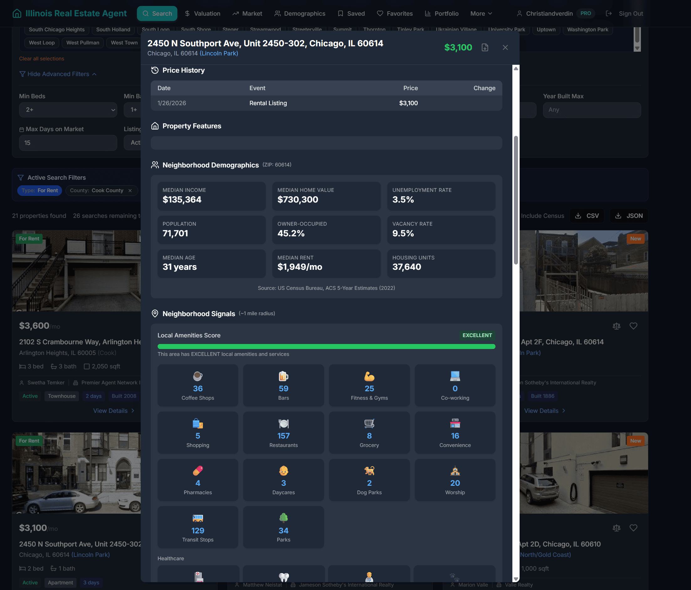

  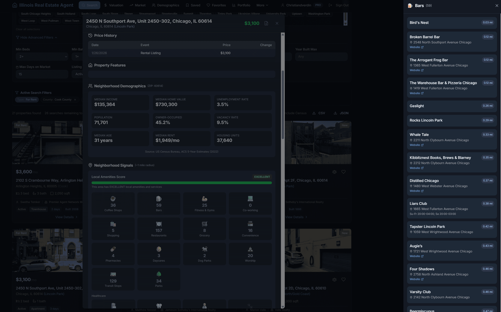

<b>View More Screenshots</b>

 

  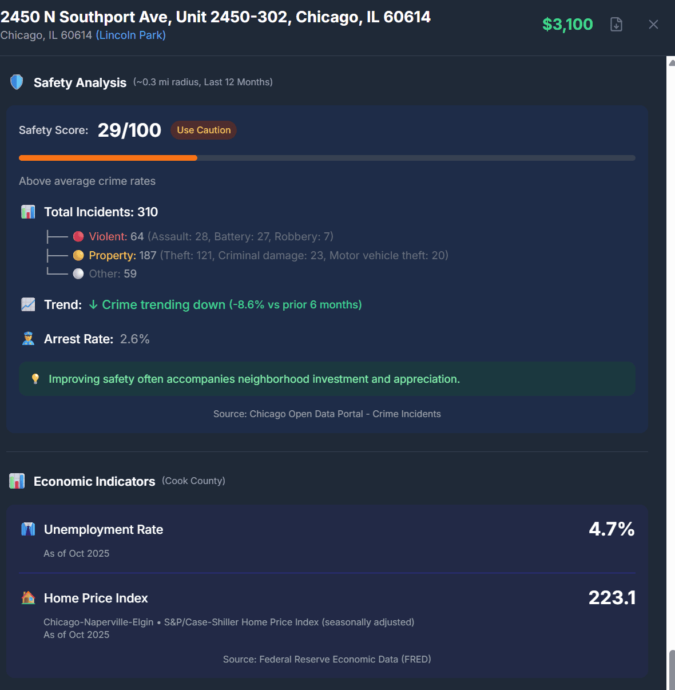

  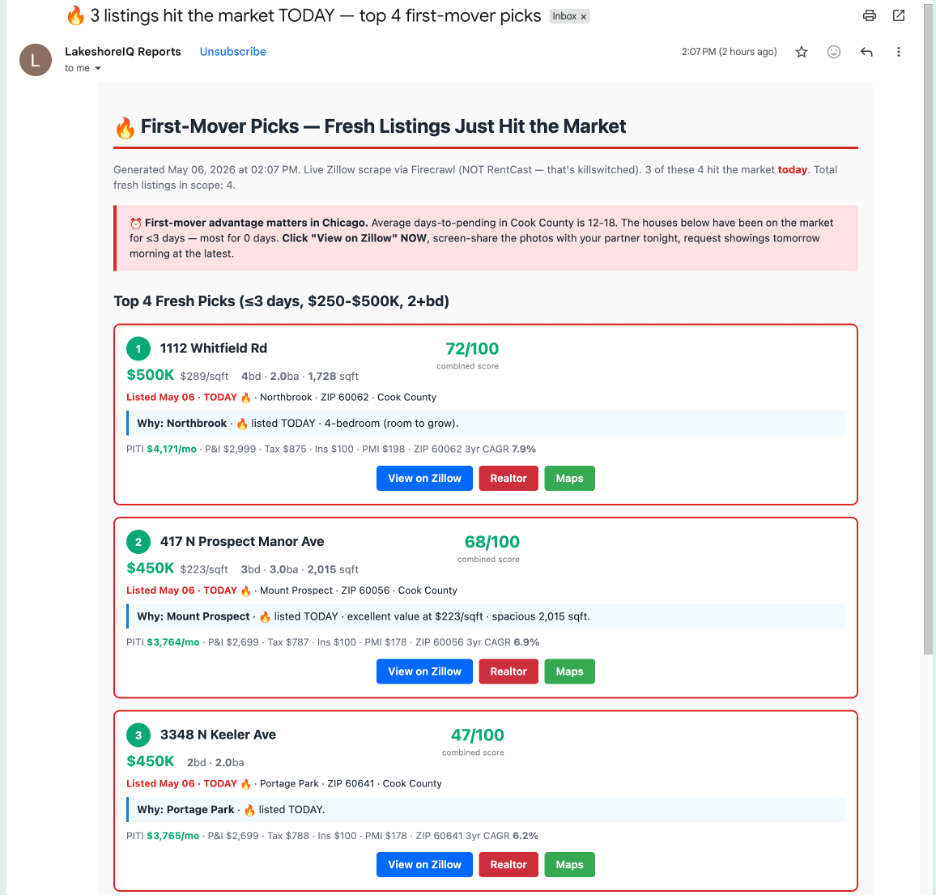

  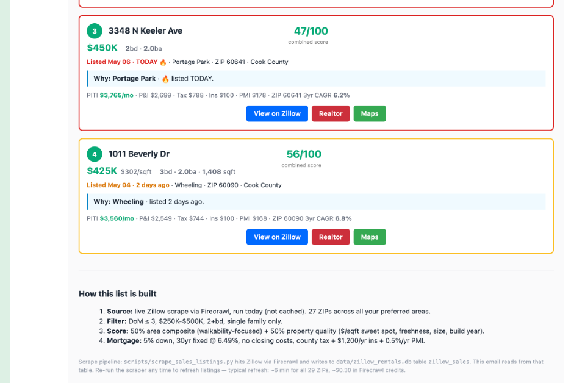

  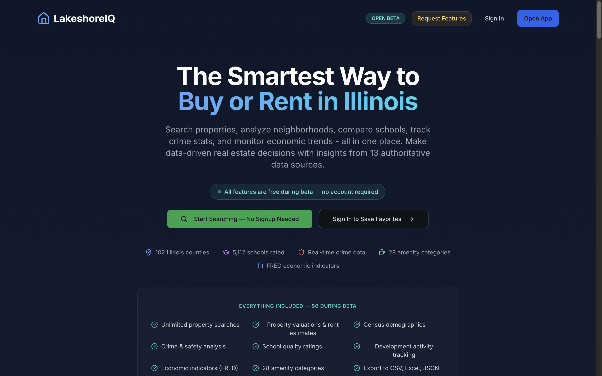

  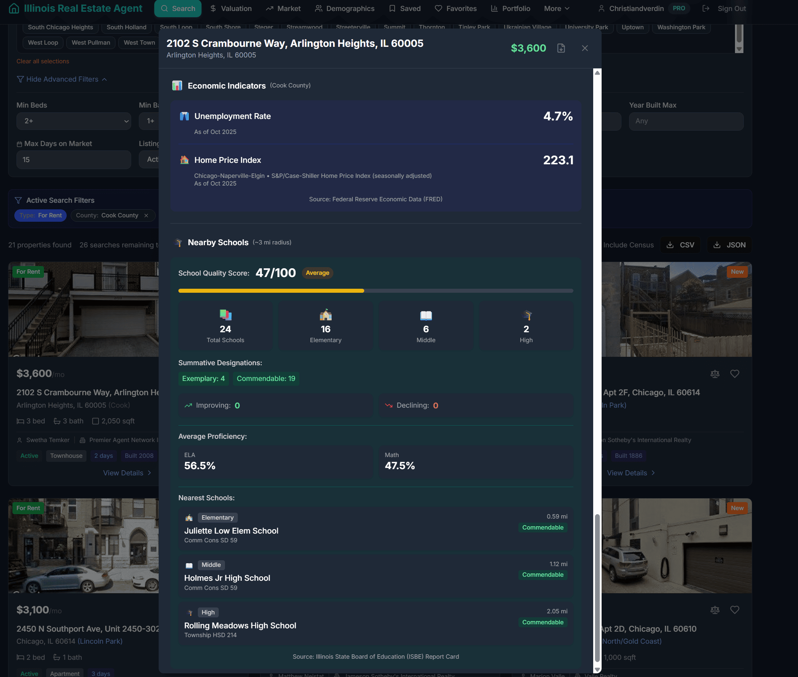

  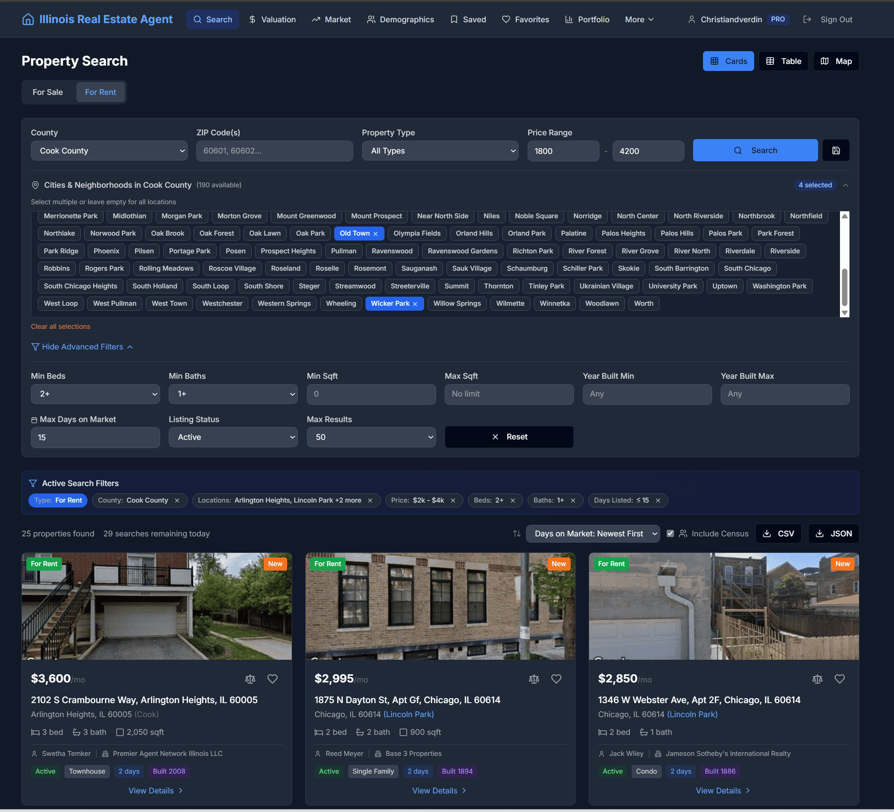

  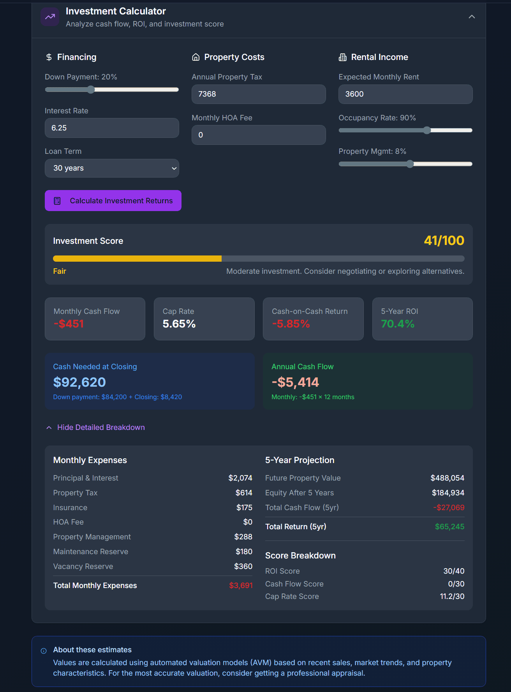

**Key Capabilities:**
- **Property Search Engine** — Filters by county, city, 50+ Chicago neighborhoods, property type, price, beds/baths, sqft, year built, and days on market with Street View imagery and listing photos
- **Automated Valuations** — RentCast AVM with confidence scoring, rent estimates with comparable analysis, and a full investment calculator (cash flow, cap rate, cash-on-cash return, 5-year ROI projection)
- **Market Analysis** — ZIP-level sale and rental metrics with 2BR rental stats computed from active listings; side-by-side comparison of up to 5 ZIP codes
- **Neighborhood Intelligence** — 28-category amenity scoring via OpenStreetMap, walkability proxy, and drilldown into specific amenity types within configurable radius
- **Crime & Safety Analysis** — Chicago crime data with safety scoring (0-100), violent/property breakdown, arrest rates, and 6-month trend detection (Chicago only, Socrata API)
- **Development Activity Tracking** — Building permits, business licenses, and liquor licenses scored into a development activity index with investment breakdowns (Chicago only)
- **School Quality Ratings** — 5,112 Illinois schools with ISBE Report Card data, geocoded locations, proficiency trends, and quality scoring by designation
- **Economic Indicators** — County unemployment rates and Chicago metro home price index via FRED API with year-over-year trend analysis
- **Census Demographics** — ZIP-level population, income, housing, employment, and education data from the U.S. Census Bureau
- **SaaS Monetization** — Three-tier subscription model (Free / Starter $9.99/mo / Pro $24.99/mo) with Stripe Checkout, usage metering, and feature gating
- **B2B API** — Tiered pricing ($199-$999+/mo) with developer portal for API key management, usage tracking, and documentation
- **10-Tool MCP Server** — Property search, valuations, crime, schools, demographics, development activity, economic indicators, amenities, neighborhood comparison, and investment analysis — all accessible as AI agent tools

**Architecture & Technical Highlights:**
- **Frontend:** Next.js 15 App Router, React 19, TypeScript, Tailwind CSS, shadcn/ui, Zustand, Recharts
- **Backend:** FastAPI with async endpoints, 10 service modules, Redis caching (Upstash), Pydantic validation
- **Database:** Supabase (PostgreSQL) with Row-Level Security, plus SQLite for ISBE school data (5,112 schools, 94% geocoded)
- **Auth:** Supabase Auth with JWT validation, protected API routes, email verification
- **Payments:** Stripe integration (checkout sessions, webhooks, customer portal, usage enforcement)
- **Data Sources:** RentCast API, U.S. Census Bureau, OpenStreetMap Overpass, Chicago Open Data Portal (3 datasets), FRED API, ISBE Report Card, Google Street View, Google Analytics 4
- **Geocoding:** Census Batch Geocoder (primary) + Nominatim fallback for school location resolution
- **Caching Strategy:** Redis with tiered TTLs — 1hr (property), 1 day (crime/permits), 7 days (amenities/FRED), 30 days (schools), 1 year (census)
- **Deployment:** Vercel (frontend, auto-deploy from main) + Railway (backend) with environment-based configuration

**Built With:**

`Next.js 15` `React 19` `TypeScript` `FastAPI` `Python` `Supabase` `PostgreSQL` `Redis` `Stripe` `Tailwind CSS` `shadcn/ui` `Zustand` `Recharts` `SQLite` `Google Street View API`

---

### 312Deals - Chicago Food & Drink Deals
**AI-Powered Restaurant Deal Intelligence Platform with Multi-Agent Pipeline & MCP Server**

A production platform aggregating **6,800+ venues**, **8,000+ active deals**, and **73 neighborhoods** across Chicagoland. Multi-channel delivery (18-endpoint REST API, 11-tool MCP Server, ChatGPT CustomGPT, AI Chat) all backed by a single SQLite database. Features an automated deal collection pipeline using LLM extraction across web, social media, and email-based content sources — with content hashing (~60-80% API cost savings), adaptive scheduling, and **5,810 tracked deal sources**. Weekly "Deal Sheet" newsletter via Resend with DKIM/SPF/DMARC. Multi-select filters for neighborhoods, cuisines, and deal types with collapsible sidebar. Seasonal content guides (St. Patrick's Day) and active SEO campaign with 2,520+ Google-indexed pages.

**Live:** [312deals.com](https://312deals.com)

  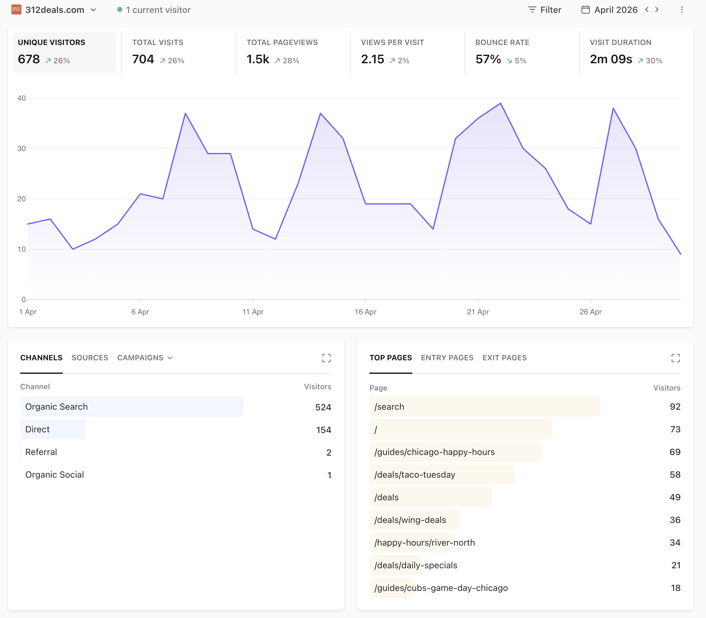

  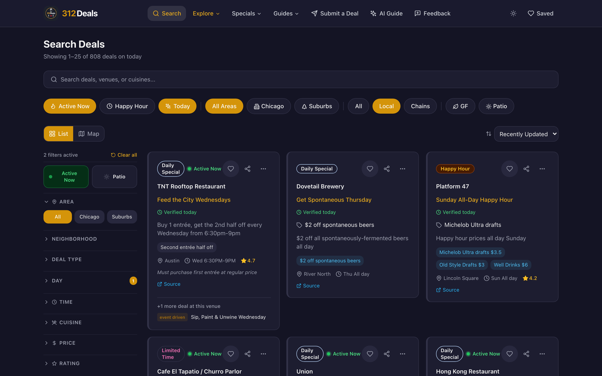

<b>View More Screenshots</b>

 

  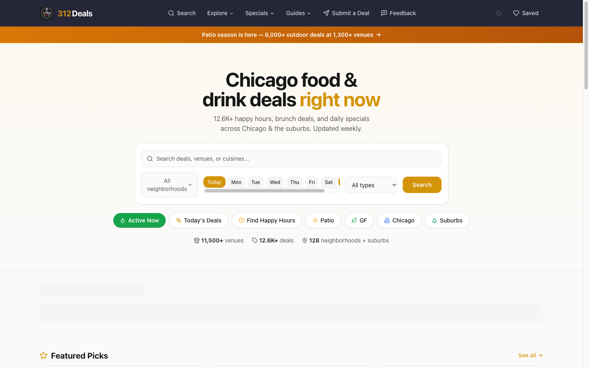

  

  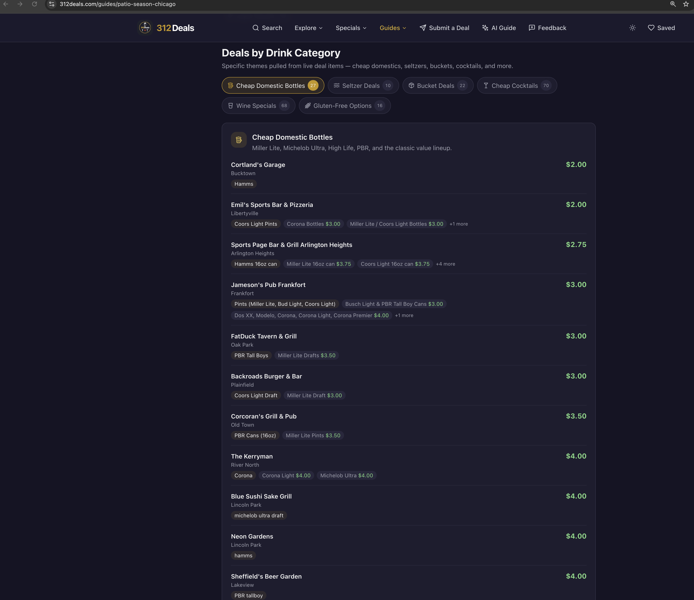

  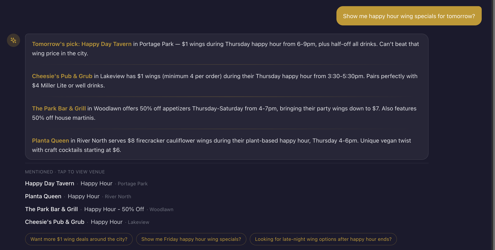

  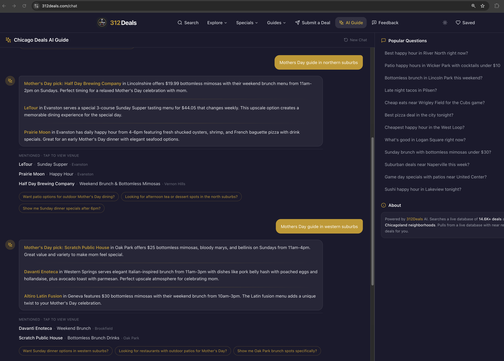

  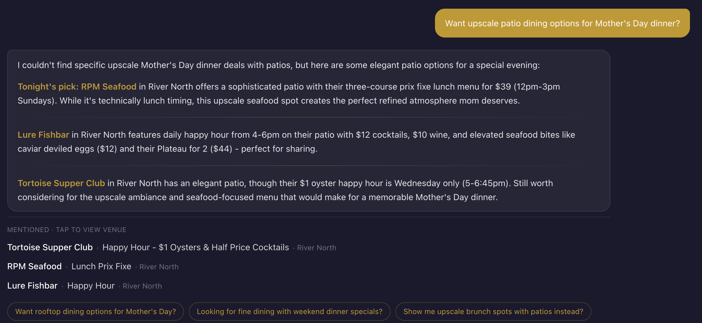

**Key Capabilities:**
- **18-Endpoint REST API** — Search by neighborhood, day, deal type, cuisine, price, rating, and time with geo-proximity queries, autocomplete, and a multi-stop bar crawl planner
- **11-Tool MCP Server** — FastMCP server enabling AI agents to search deals, compare neighborhoods, get featured deals, and generate weekly digests
- **ChatGPT CustomGPT** — Natural language deal search via OpenAI's custom GPT interface backed by the same REST API
- **Multi-Select Filters** — Collapsible sidebar with multi-select for neighborhoods, deal types, and cuisines enabling granular deal discovery
- **Multi-Source Deal Pipeline** — 5,810 tracked sources spanning deal pages, social media platforms, newsletters (AgentMail), and venue websites. Content hashing skips unchanged pages (~60-80% cost savings). Adaptive scheduling with exponential backoff for failing sources
- **AI Chat** — Natural language deal search at `/chat` powered by Claude API (Sonnet 4) with context-aware responses
- **Seasonal Content Guides** — Programmatic event-driven pages (St. Patrick's Day, holidays) with themed filtering and venue grouping
- **AI Extraction Pipeline** — Claude API parses unstructured venue HTML into structured deals via Pydantic validation with automated quality scoring (0-100)
- **Owner.com Integration** — Auto-detection and tagging of Owner.com restaurants with "Order Online" CTAs on venue pages
- **Time-Aware Search** — Chicago timezone logic for "happening now" deals with day-of-week and time-range filtering
- **Community Verification** — User reports (outdated/confirm active) with aggregate summary views and smart verification queue
- **100+ SEO Landing Pages** — Programmatic pages for 73 neighborhoods, 8 university guides, cuisine types, happy hour guides, and chain brand pages with JSON-LD structured data
- **PWA with Offline Support** — Progressive Web App installable on mobile with service worker caching

**Architecture & Technical Highlights:**
- **Frontend:** Next.js 14 App Router, TypeScript, Tailwind CSS, Radix UI (40+ components), React Query, dark mode, PWA
- **Backend:** FastAPI with 18 endpoints on Railway, rate limiting (slowapi), retry logic (tenacity)
- **Database:** SQLite with WAL mode, FTS5 full-text search, 80+ venue metadata columns (patio, dog-friendly, sports bar, cuisine, OpenTable/Resy URLs)
- **AI/ML:** Claude API for deal extraction + verification, Pydantic models for validation, quality scoring algorithm
- **MCP:** FastMCP server with 11 tools
- **Deal Pipeline:** Multi-source content ingestion (web, social, email) → LLM extraction → quality scoring → publish. Weekly automated refresh with 7 serial phases
- **Enrichment:** Firecrawl social/URL discovery, Google Places API, OpenTable metadata, CSV import pipeline
- **Deployment:** Vercel (frontend) + Railway (backend), weekly cron via GitHub Actions
- **Email:** Resend with DKIM/SPF/DMARC, newsletter system with subscribe/unsubscribe endpoints

**Built With:**

`Next.js 14` `TypeScript` `FastAPI` `Python` `SQLite` `Claude API` `FastMCP` `Firecrawl` `Apify` `AgentMail` `Resend` `Google Places API` `Tailwind CSS` `Radix UI` `Vercel` `Railway`

---

### NFL Analytics Engine
**Statistical Intelligence & Visualization Platform** | *2025-26 Season Complete ✅*

A comprehensive analytics system for NFL game prediction, processing **285 games**, **14,900+ player-quarter records**, **22,700+ snap counts**, and **1,455 TD events** through Super Bowl LX (SEA 29, NE 13). Features automated matchup reports, real-time visualization generation, and predictive pattern recognition with **18,900+ historical game outcomes** analyzed.

  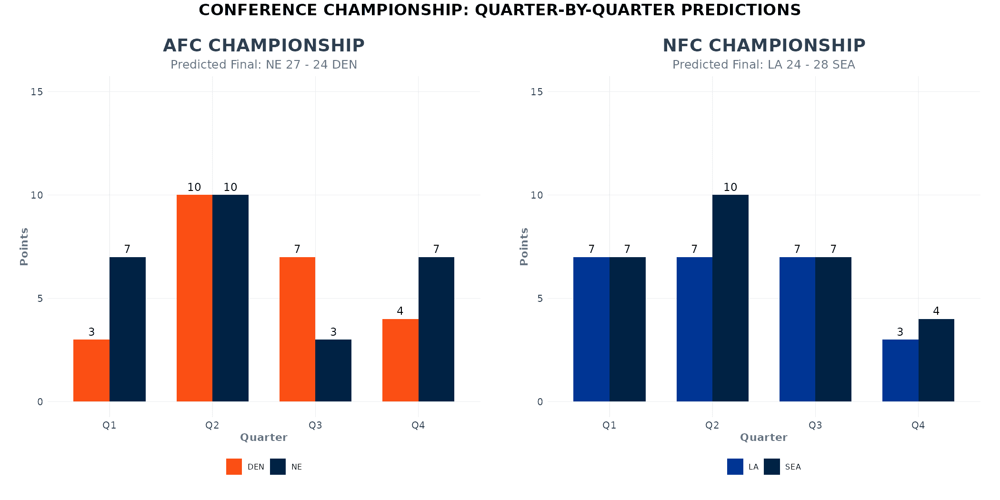

  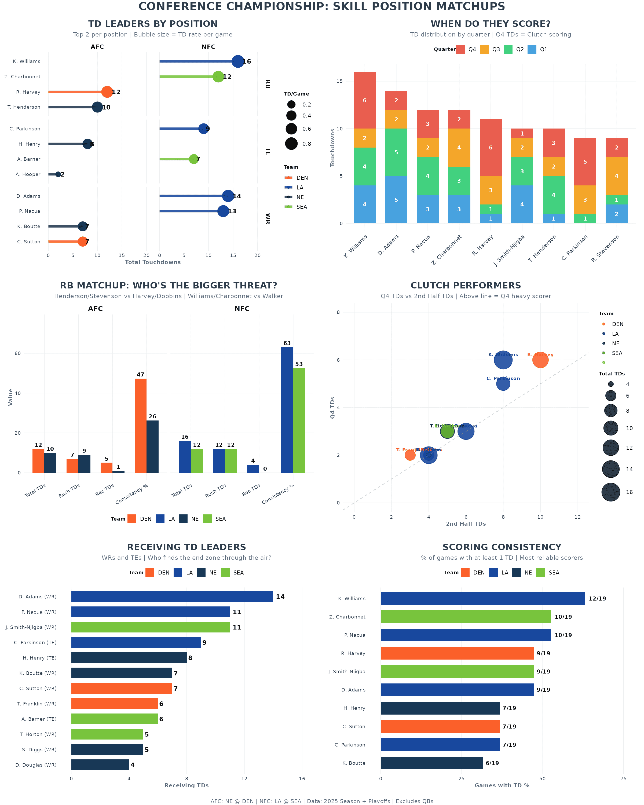

<b>View More Screenshots</b>

 

  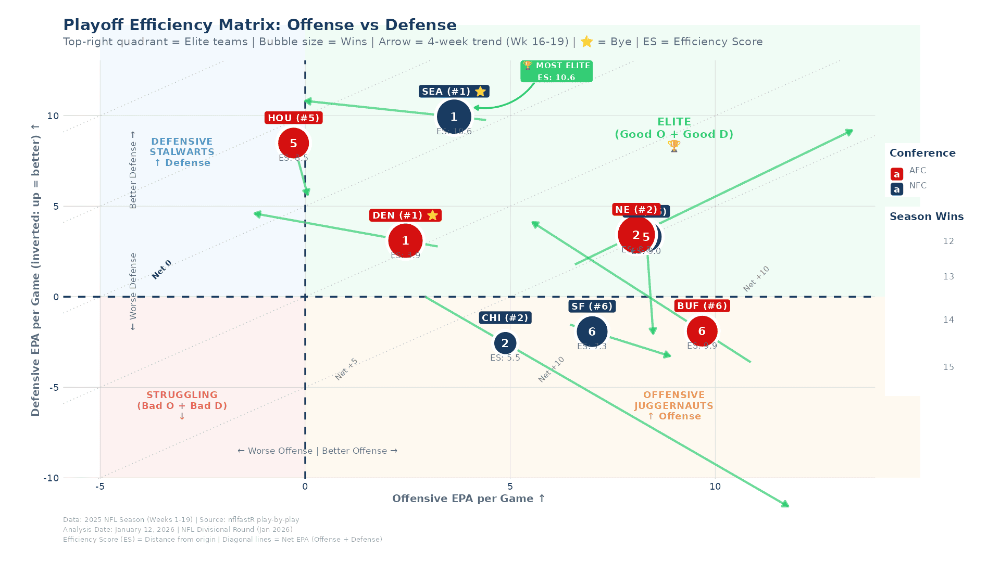

  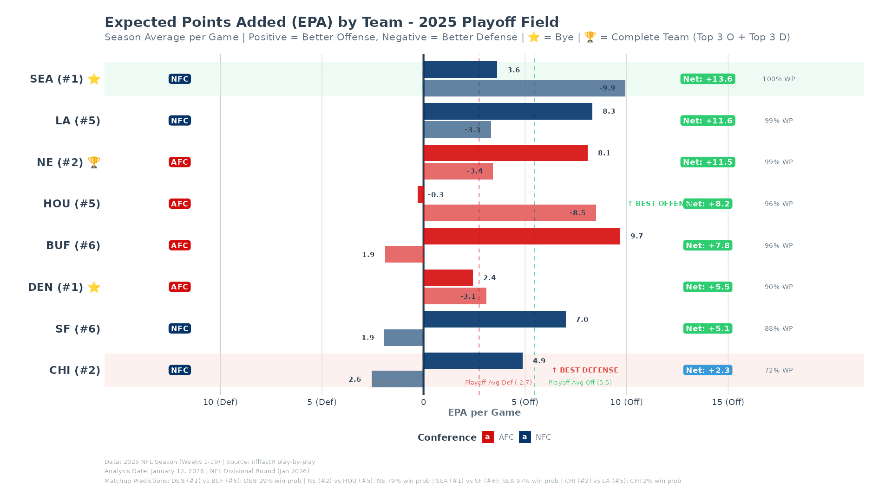

  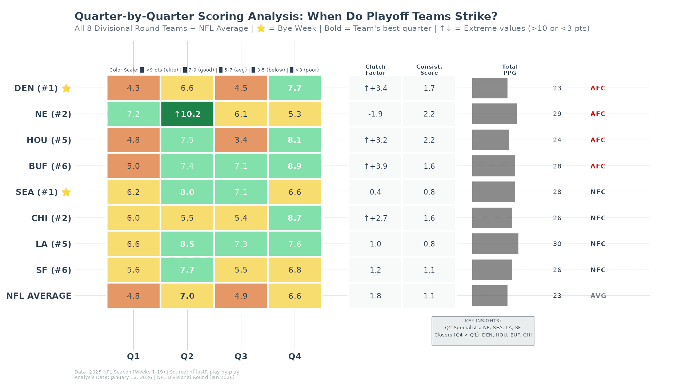

**Key Capabilities:**
- **Matchup Intelligence System** — Generates 14-page reports per game with player trends, red zone efficiency, and situational analysis across 116+ matchup reports
- **Quarter-by-Quarter Tracking** — 1,455 TD events and 14,900+ player stat records with Q1-Q4 breakdowns for granular performance analysis
- **Visualization Engine** — 21 custom playoff visualizations including skill position dashboards, TD probability gauges, and clutch performer analysis
- **Playoff Scenario Simulator** — Win/loss impact modeling for seeding scenarios with elimination risk detection
- **Player Trend Analysis** — Distinguishes usage pattern changes and identifies breakout performers with 20%+ usage increases

**Technical Highlights:**
- **Data Pipeline:** R-based ETL processing 500+ metrics per game via nflreadr API with SQLite persistence
- **Statistical Modeling:** EPA calculations, efficiency matrices, player trend detection (20%+ usage changes)
- **Visualization:** ggplot2 with custom `theme_nfl_playoff()`, multi-panel dashboards via gridExtra
- **Database:** 9 core tables + 5 quarter-level tracking tables with parameterized query wrappers
- **Automation:** Batch game analysis processing 14 games in parallel with `analyze_week_matchups.sh`

**Built With:**

`R` `tidyverse` `ggplot2` `SQLite` `nflreadr` `gridExtra` `Cairo`

[View Repository →](https://github.com/ChristianVerdin/nfl_analytics)

---

### Daily Locks AI
**Multi-Sport AI Agent with LLM-Powered Analytics & Conference Tournament Intelligence**

A full-stack application featuring an agentic AI system that processes natural language queries against **730 NCAAB teams / 6,333+ games** and **18,900+ historical NFL outcomes** (archived). Features 7 dedicated analysis pages, real-time ESPN live score monitoring, conference tournament bracket tracking with Monte Carlo futures simulation, and a proprietary second-half scoring model. NCAAB model v2.1 with fatigue modeling, rest day adjustments, and H2H context for tournament play.

**Live:** [dailylocks.ai](https://dailylocks.ai)

  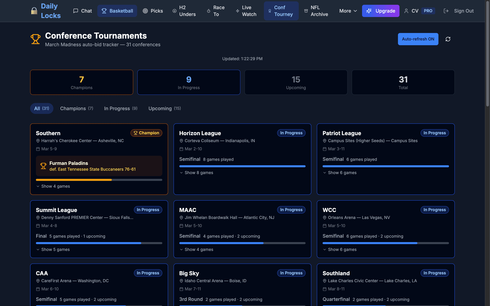

<b>View More Screenshots</b>

 

  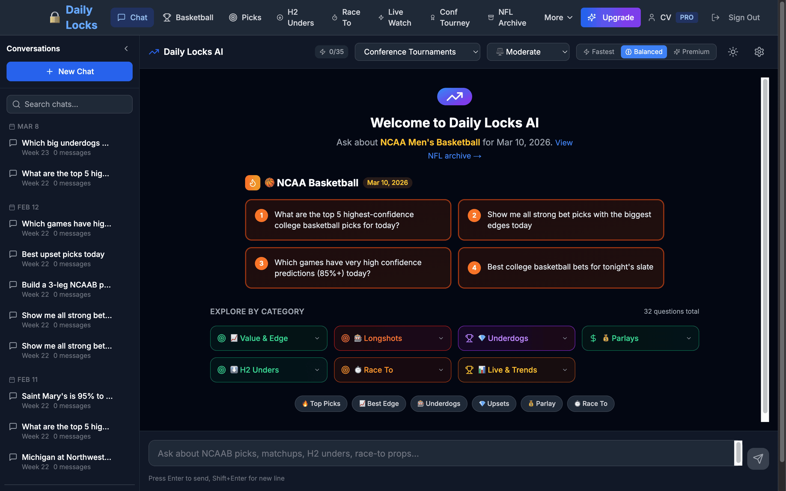

  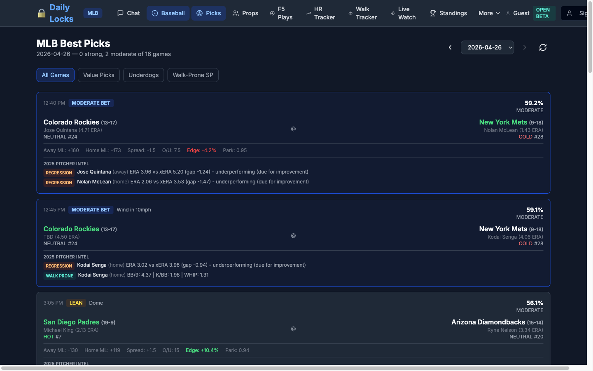

  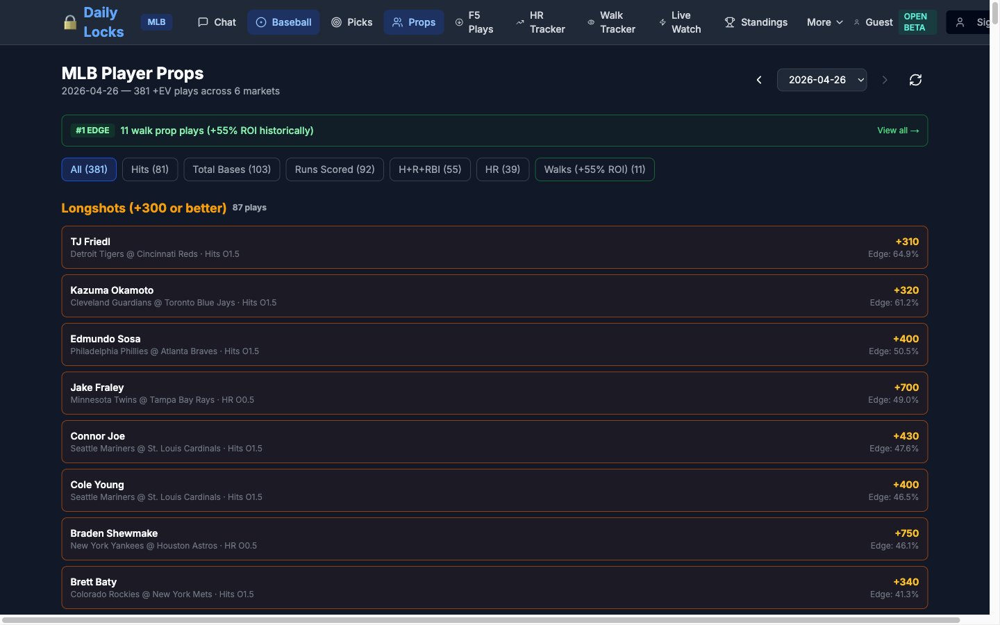

**Key Features:**
- **Conference Tournament Intelligence** — Live bracket tracking with auto-refresh, Monte Carlo simulation for tournament futures, fatigue modeling with rest day and travel adjustments, round robin and parlay builders
- **Multi-Sport Detection** — Automatic routing between NFL (archived, 2025-26 complete) and NCAAB analysis based on query context
- **7 Analysis Pages** — Matchups, Picks, H2 Unders, Race-To Props, Live Scores, Conference Tournament Tracker, NFL Archive
- **NCAAB Predictions v2.1** — 730 teams with KenPom-style efficiency metrics, daily automated predictions, and tournament-specific fatigue/rest modeling
- **Live Score Monitoring** — Real-time ESPN API integration with dynamic recommendation adjustments based on game state (pre-game, H1, halftime, final)
- **Natural Language Interface** — Context-aware prompt engineering with multi-model LLM routing (Claude Haiku/Sonnet/Opus)
- **Telegram Alert Pipeline** — Momentum detection, adaptive polling, live recommendations, upset alerts, and tracking via automated alert pipeline

**Architecture & Technical Highlights:**
- **Frontend:** Next.js 15 App Router, React 19, TypeScript, Zustand state management, Vercel Analytics
- **Backend:** FastAPI with async endpoints, intelligent agent routing system, Redis caching (Railway)
- **AI/ML:** Anthropic Claude API, dynamic prompt construction, context windowing, sport-specific handler bypass ($0 cost NCAAB queries), multi-model routing
- **Live Data:** ESPN public API integration, 60-second polling, game_id matching between ESPN and prediction CSVs, conference tournament bracket tracking
- **Database:** Supabase (PostgreSQL) with Row-Level Security, real-time subscriptions
- **Auth:** JWT-based authentication with auto-refresh token handling
- **Payments:** Stripe integration (checkout sessions, webhooks, customer portal)
- **Data Pipeline:** Automated daily R pipeline (ESPN data → SQLite → predictions → CSV sync → Vercel deploy)
- **Testing:** 161 automated tests with pytest
- **Observability:** Helicone for LLM monitoring and analytics

**Built With:**

`Next.js 15` `React 19` `TypeScript` `FastAPI` `Python` `Claude API` `Supabase` `Stripe` `Tailwind CSS` `Zustand` `ESPN API` `Helicone`

---

### NCAAB Analytics
**College Basketball Prediction System v2.1** | *Conference Tournament Live*

A production-grade analytics pipeline for NCAA Men's Basketball that combines possession-based efficiency metrics with real-time Vegas odds to generate daily game predictions, second-half scoring models, race-to-points analysis, and conference tournament intelligence. v2.1 adds fatigue modeling, rest day adjustments, and H2H context for tournament play. Powers the Daily Locks AI prediction engine with automated daily data pipelines.

  

**Key Capabilities:**
- Possession-based efficiency metrics (KenPom-style) normalized per 100 possessions
- Iterative strength of schedule using Colley-like algorithm (10 iterations)
- Volatility detection identifying high-variance matchups for live betting
- +EV edge detection comparing model probability vs Vegas implied probability
- Conference tournament analysis with fatigue modeling, rest day adjustments, and H2H context
- Pick review system for tracking agent picks by tier
- Automated daily pipeline: ESPN import → odds fetch → predictions → CSV sync

**Technical Highlights:**
- **Data Pipeline:** R-based ETL processing 730 teams and 6,333+ games with daily incremental updates
- **Statistical Modeling:** Four-factor analysis, adaptive recency weighting (14-day half-life), form detection (HOT/COLD)
- **Odds Integration:** The Odds API for real-time Vegas lines (spreads, totals, moneylines) with consensus line aggregation
- **H2 Scoring Model:** Per-team second-half point projections with joint probability calculations
- **Database:** SQLite (~39MB) with optimized schema for analytical queries
- **Agent Integration:** Daily CSV exports synced to Daily Locks AI via `sync_to_agent.sh`

**Built With:**

`R` `tidyverse` `SQLite` `The Odds API` `ESPN API` `hoopR` `Statistical Modeling`

---

## Technical Skills

<table>
<tr>
<td valign="top" width="33%">

### Languages

</td>
<td valign="top" width="33%">

### Frontend

</td>
<td valign="top" width="33%">

### Backend & Data

</td>
</tr>
<tr>
<td valign="top" width="33%">

### AI & ML

</td>
<td valign="top" width="33%">

### Infrastructure

</td>
<td valign="top" width="33%">

### Tools

</td>
</tr>
</table>

---

## Let's Connect

I'm always open to collaborating on projects together so feel free to reach out!

  
  
  

  <i>Open to full-time senior IC roles in AI/ML engineering, applied data science, and building AI-powered products.</i>

  <a href="mailto:christiandverdin@gmail.com">christiandverdin@gmail.com</a>

