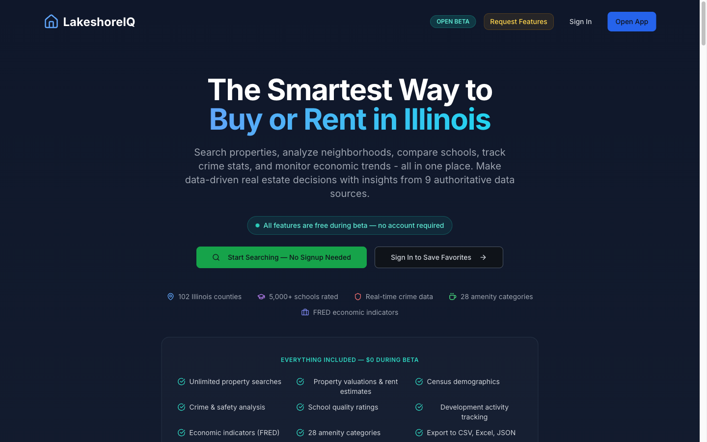

# Hi there, I'm Christian Verdin

**Senior Data Scientist & AI/ML Engineer** with 7+ years of experience designing, developing, and deploying end-to-end ML/AI systems — from data pipelines and production models to complete applications that drive real business impact.

I build production-grade systems that integrate LLMs, real-time data pipelines, and modern web frameworks to solve complex analytical problems.

---

## Projects at a Glance

| Project | What it does | Status | Stack |
|---------|--------------|--------|-------|
| **LakeshoreIQ** | Real estate intelligence platform — 12 data sources, ZIP-level appreciation analytics, 3-pathway valuation methodology | Live · Open Beta | Next.js · FastAPI · Supabase |
| **312Deals** | Chicago food & drink deals — 12,000+ venues, 15,000+ deals, multi-channel agent surface (REST · MCP · WebMCP · ChatGPT) | Live | Next.js · FastAPI · SQLite · MCP |
| **Daily Locks AI** | Multi-domain AI agent for sports intelligence — Claude-powered chat, intent routing, multi-sport prediction surface | Live · Open Beta | Next.js · FastAPI · Claude · Stripe |
| **NFL Analytics** | Pure R analytics engine — 285 games, 21 custom playoff visualizations, 116+ matchup reports | 2025-26 Complete | R · ggplot2 · SQLite |
| **MLB 2026** | Active production modeling pipeline — 16-step daily run, validated alpha-pattern detection, automated deploy | Live (in-season) | R · Python · Supabase |

---

## Featured Projects

### LakeshoreIQ — Illinois Real Estate Intelligence
**Property search, valuation, and market analysis platform**

A production SaaS aggregating 12 real-time data sources to deliver property search, automated valuations, and neighborhood intelligence across 150+ Illinois cities and 50+ Chicago neighborhoods. Integrates census demographics, ISBE school ratings (5,112 schools, 94% geocoded), FEMA flood zones, FBI crime data, FRED economic indicators, and 14,176 transit stops across CTA, Metra, and Pace into a unified property analysis experience. Three-pathway valuation methodology, ZIP-level appreciation analytics across 1,076 IL ZIPs, and automated weekly buyer reports.

**Live:** [lakeshoreiq.com](https://lakeshoreiq.com)

  

**Built with:** `Next.js 15` · `React 19` · `TypeScript` · `FastAPI` · `Python` · `Supabase` · `PostgreSQL` · `Redis` · `Stripe` · `Tailwind CSS`

[View Repository →](https://github.com/ChristianVerdin/illinois-real-estate)

---

### 312Deals — Chicago Food & Drink Deals
**AI-powered restaurant deal intelligence platform**

A production platform aggregating 12,000+ active venues and 15,000+ active deals across 128 Chicagoland neighborhoods (52 city + 76 suburban). Multi-channel agent surface: 26 REST endpoints, 11-tool FastMCP server, 10 in-browser WebMCP tools, and a ChatGPT custom GPT — all backed by a single SQLite database. Automated multi-source deal collection pipeline using Claude API for extraction, Firecrawl for web scraping, Apify for social media ingestion, and AgentMail for newsletter parsing. Content hashing reduces API costs 60–80%; adaptive scheduling handles 5,810 tracked sources.

**Live:** [312deals.com](https://312deals.com)

  

**Built with:** `Next.js 14` · `TypeScript` · `FastAPI` · `Python` · `SQLite` · `Claude API` · `FastMCP` · `Firecrawl` · `Apify` · `AgentMail` · `Vercel` · `Railway`

[View Repository →](https://github.com/ChristianVerdin/chideals)

---

### Daily Locks AI — Multi-Domain AI Agent for Sports Intelligence
**Consumer-facing AI agent unifying multi-sport prediction backends**

A production AI agent surfacing multi-sport prediction outputs (NCAAB, MLB, NFL) through a Next.js consumer product and a Claude-powered conversational interface. Multi-step intent routing translates natural-language questions into structured queries against tier-based confidence models, with calibrated tiering (VERY_HIGH · STRONG_BET · LEAN) exposing the highest-conviction picks. Real-time ESPN scoreboard integration, automated Telegram alert delivery, and Stripe-based subscription billing. Closed the 2025-26 NCAAB season with full tier-based accuracy tracking across 1,835 graded predictions and 730 teams.

**Live:** [dailylocks.ai](https://dailylocks.ai)

  

**Built with:** `Next.js 15` · `React 19` · `TypeScript` · `FastAPI` · `Python` · `Claude API` · `Supabase` · `Stripe` · `ESPN API`

---

### NFL Analytics — Pure R Engine for Playoff & Matchup Analysis
**Statistical visualization toolkit with 21 custom charts and 116+ matchup reports**

A pure R analytics engine that processed 285 NFL games, 14,900+ player-quarter records, 22,700+ snap counts, and 1,455 TD events from the 2025-26 season (closed at Super Bowl LX). Twenty-one custom playoff visualizations spanning EPA comparisons, efficiency matrices, quarter-scoring heatmaps, third-down and red-zone breakdowns, explosive-play and turnover analytics, and skill-position matchup charts. 116+ scripted matchup reports generated through ggplot2 and SQLite pipelines.

  

**Built with:** `R 4.5` · `tidyverse` · `ggplot2` · `dplyr` · `SQLite` · `RSQLite` · `DBI`

---

### MLB 2026 — Active Production Modeling Pipeline
**16-step daily pipeline ingesting play-by-play, lineups, and authoritative odds**

An active production modeling pipeline running on a 3x-daily cadence (8 AM · 11 AM · 2 PM CT) throughout the 2026 MLB season. The 16-step orchestrator ingests play-by-play, lineup, weather, and odds data; applies validated alpha-pattern detection across career history, geographic context, and situational matchups; and auto-deploys generated picks to dailylocks.ai via scheduled launchd jobs. Anti-hallucination odds verification fails loudly when authoritative sources are missing, preventing silent fall-throughs.

**Built with:** `R` · `Python` · `Supabase` · `Odds API` · `RotoWire` · `ESPN API` · `launchd`

---

## Technical Skills

<table>
<tr>
<td valign="top" width="33%">

### Languages

</td>
<td valign="top" width="33%">

### AI & ML

</td>
<td valign="top" width="33%">

### Frontend

</td>
</tr>
<tr>
<td valign="top" width="33%">

### Backend & Data

</td>
<td valign="top" width="33%">

### Cloud & ML Platforms

</td>
<td valign="top" width="33%">

### Tools

</td>
</tr>
</table>

---

## Let's Connect

Open to senior IC and beginner-manager roles in AI/ML, applied ML, data platform, and AI-product engineering — particularly where production scale and modern AI tooling intersect.

  
  
  

  <a href="https://www.linkedin.com/in/christian-verdin/">Reach me on LinkedIn</a>

---
