# Christian Verdin

**AI engineer and senior data scientist who ships agentic systems to production and keeps them running.**

Seven years of production ML at Fortune 500 scale. By day I lead production AI for a Fortune 500 data science team: a multi-agent analytics platform on Databricks used by hundreds of business users, the evaluation and observability layer behind it, and the MCP surface that lets other AI clients call it. By night I ship the projects below: production-deployed, written outside work hours, built end to end by me, and run through real platform reviews (Apple App Store, Amazon Ring Appstore).

**Looking at:** AI Engineer · Forward Deployed Engineer · Solutions Architect (AI/Data) · Senior Data Scientist (GenAI). Chicago, remote, or relocation.

---

## Projects

| Project | What it does | Status | Stack | Code |
| --- | --- | --- | --- | --- |
| [**312Deals**](#312deals--chicago-food--drink-deals) | Chicago food & drink deals: 90,000+ active deals across 12,500+ venues and 149 neighborhoods from thousands of tracked sources, ingested by an LLM extraction pipeline. Agent-first surface: REST API · 11-tool MCP server · 17 WebMCP tools · custom GPT · in-app chat | **Live** | Next.js · FastAPI · SQLite on Cloudflare R2 · MCP | [312deals-webmcp](https://github.com/ChristianVerdin/312deals-webmcp) · MIT (WebMCP Challenge entry) |
| [**CFB GameDay Board**](#cfb-gameday-board--college-football-slate-on-web-and-ios) | Every FBS game on one screen: kickoff-hour stadium weather, TV, posted lines with implied scores, then live cover/total state. Stdlib Python, vanilla JS, zero dependencies; SwiftUI iOS shell | **Live · App Store** | Python · JavaScript · SwiftUI · Vercel | [cfb-gameday-board](https://github.com/ChristianVerdin/cfb-gameday-board) · MIT |
| [**LakeshoreIQ**](#lakeshoreiq--illinois-real-estate-intelligence) | Illinois real-estate intelligence over 9 live data sources; AVM, rent comps, neighborhood scoring; 10-tool MCP server | Open beta | Next.js · FastAPI · PostgreSQL · Redis | private |
| [**Camera Recall**](#camera-recall--natural-language-qa-over-smart-camera-events) | Private Ring app for personal use: natural-language Q&A over my own camera event history. Deliberately metadata-only (no video, clip, or snapshot scopes). Passed Ring Appstore certification on first submission | Certified · personal | FastAPI · Postgres · Railway · 300+ tests | private |
| [**World Cup bracket tracker**](#world-cup-bracket-tracker) | Twice-daily auto-updating tracker for an AgentMail World Cup 2026 bracket. GitHub Actions + AgentMail API, no servers | Complete | Python · GitHub Actions | [worldcup_agentcup-tracker](https://github.com/ChristianVerdin/worldcup_agentcup-tracker) · MIT |

### Where to start reading

- **[312deals-webmcp](https://github.com/ChristianVerdin/312deals-webmcp)**: how a data platform exposes itself to browser-native agents. 17 tools on `document.modelContext`, a "Tonight" planner a person and their agent build together, write-with-consent tips routed to human review. Start at `docs/04-WEBMCP-ARCHITECTURE.md`.
- **[cfb-gameday-board](https://github.com/ChristianVerdin/cfb-gameday-board)**: the cleanest end-to-end example. Zero-dependency Python server and snapshot builder, vanilla JS client, SwiftUI shell, scripted App Store Connect release pipeline, GitHub Action that rebuilds the slate twice a week. Start at `docs/ARCHITECTURE.md`, then `ios/APP_STORE.md`.

---

## 312Deals — Chicago Food & Drink Deals
**LLM extraction pipeline + agent-first distribution for local commerce**

A production platform aggregating **90,000+ active deals** across **12,500+ venues** and **149 neighborhoods** across Chicagoland, ingested from **thousands of tracked sources**. The pipeline runs unstructured web, social, and email content through LLM extraction with schema validation, content hashing, adaptive scheduling with exponential backoff, and automated 0–100 quality scoring, at **under a cent per verified deal**. Distribution is agent-first: an 18-endpoint REST API, an 11-tool MCP server, 17 in-page WebMCP tools (entered in OpenAI's WebMCP Challenge, Sept 2026), a custom GPT, in-app chat, and a machine-readable `llms.txt` scoring **96/100 on Mintlify's Agent Score**. Programmatic SEO (100+ landing pages) took organic search from average position ~22 to page one. Since the March 2026 launch: **25,000+ unique visitors, 7,700+ in the last 28 days**, all organic; Search Console shows **16.4K clicks and 1.7M impressions at an average position of 6**.

**Live:** [312deals.com](https://312deals.com) · **Public code:** [312deals-webmcp](https://github.com/ChristianVerdin/312deals-webmcp)

  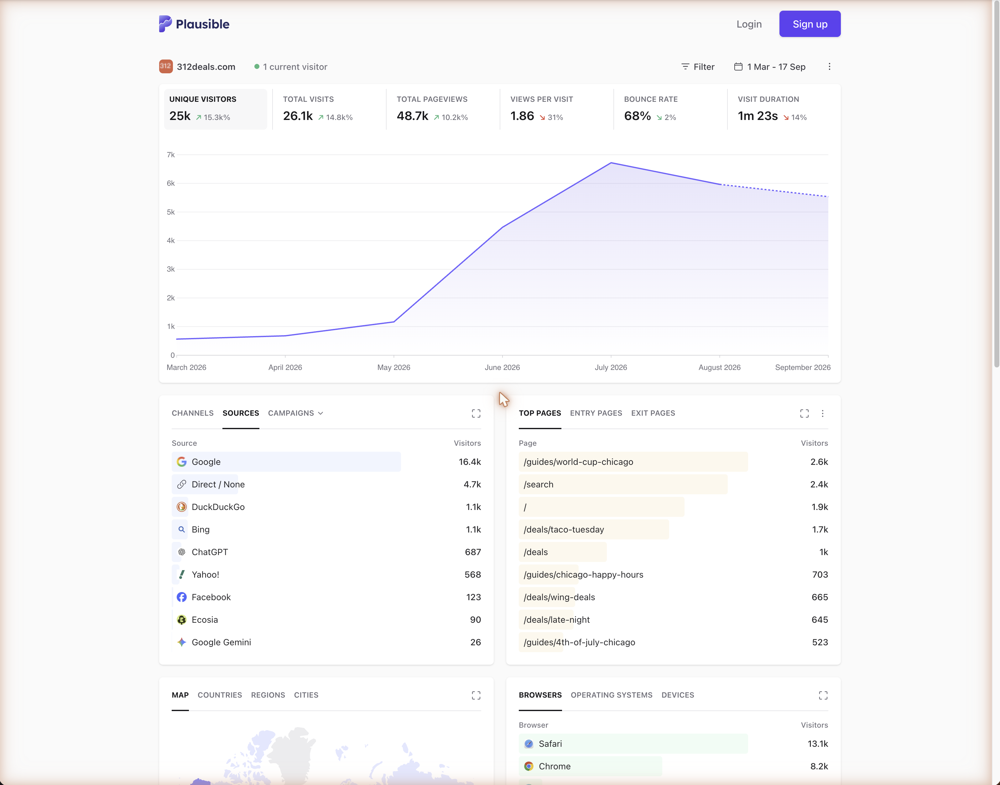

  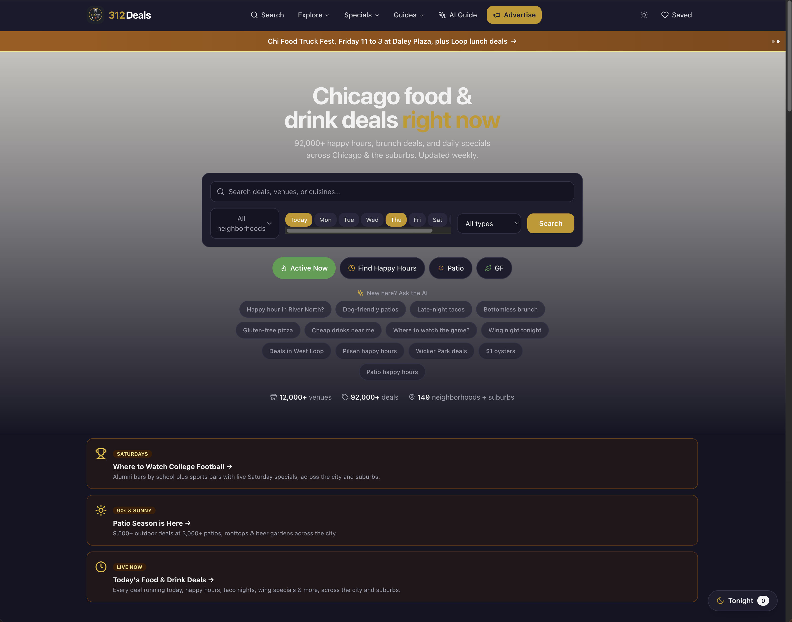

<b>More screenshots</b>

 

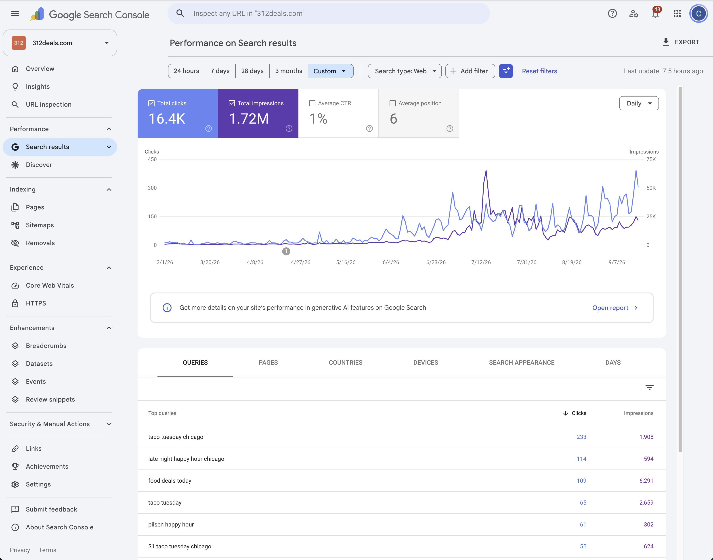

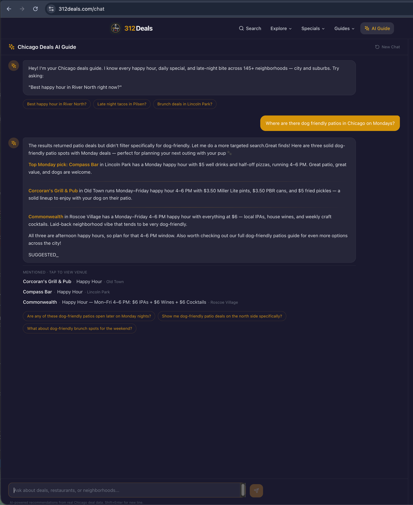

**What's interesting technically**
- **Agent surface as a first-class product:** the same tool definitions serve the MCP server, the WebMCP registration, and the custom GPT, so a person, a browser agent, and a desktop agent get identical capabilities.
- **Extraction economics:** content hashing and adaptive scheduling turned an LLM-per-page pipeline into something that costs under a cent per verified deal.
- **Eval before edit:** the extraction prompt has a hand-labeled test set and a held-out set; changes ship only when they hold on pages the prompt has never seen. That's how a cheaper model got in without a quality loss.
- **Data as a distributed artifact:** SQLite with WAL and FTS5, distributed through Cloudflare R2 with If-Match ETag guards, so the read path never blocks on the write path.
- **Quality loop:** automated 0–100 scoring plus a user-driven verification queue; public venue payloads are sanitized through an explicit allow-list.

**Built with:** `Next.js` `TypeScript` `FastAPI` `Python` `SQLite` `Cloudflare R2` `MCP / FastMCP` `WebMCP` `Railway` `Vercel` `Plausible`

---

## CFB GameDay Board — College Football Slate on Web and iOS
**One screen for every FBS Saturday | Live on the web and the App Store | Public, MIT**

Venue, kickoff-hour stadium weather, TV and streaming, publicly posted spread and total with implied scores, then live score, clock, down and distance, and cover/total state once games kick, refreshed every 30 seconds while games run. Built with a deliberately small footprint: a standard-library Python server and snapshot builder, a vanilla JavaScript client with no framework and no build step, and a native SwiftUI shell that passed App Review on the first full submission. Built, deployed to the web, and submitted to App Review in a single day. Rated 4+, free, no ads, no account, and Apple's privacy label reads **Data Not Collected**.

**Live:** [cfbgameday.app](https://cfbgameday.app) · [App Store](https://apps.apple.com/us/app/cfb-gameday-board/id6809035228) · **Source:** [cfb-gameday-board](https://github.com/ChristianVerdin/cfb-gameday-board)

  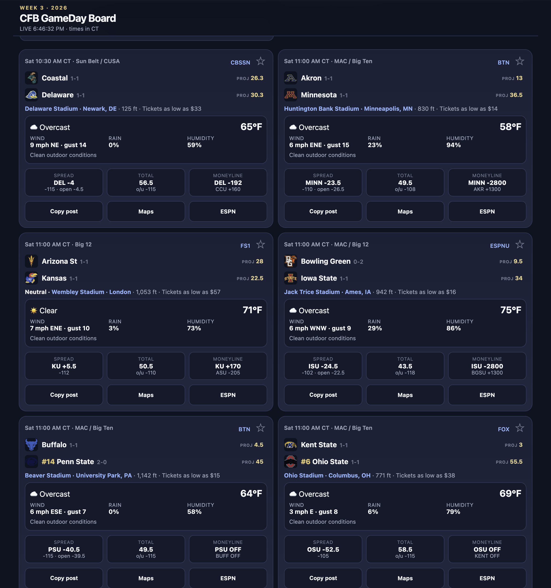

  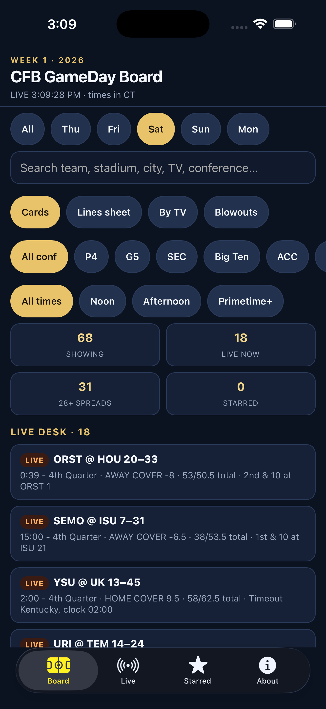
  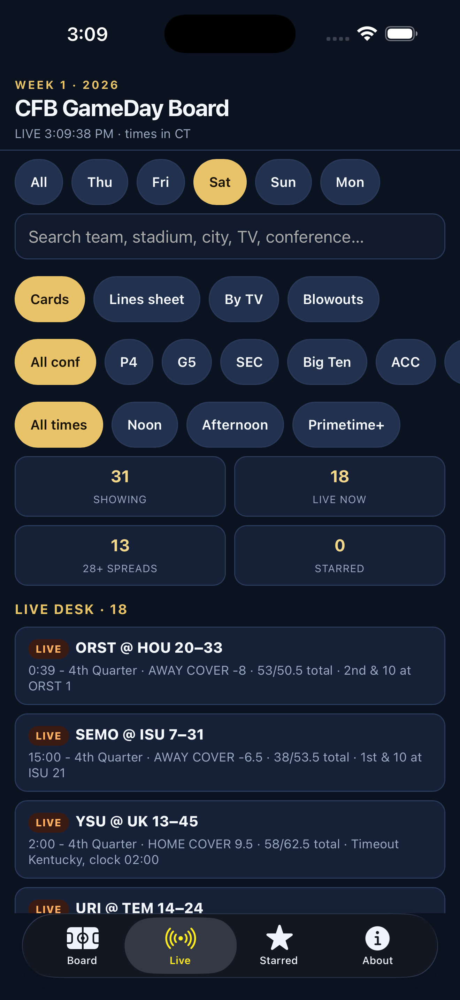
  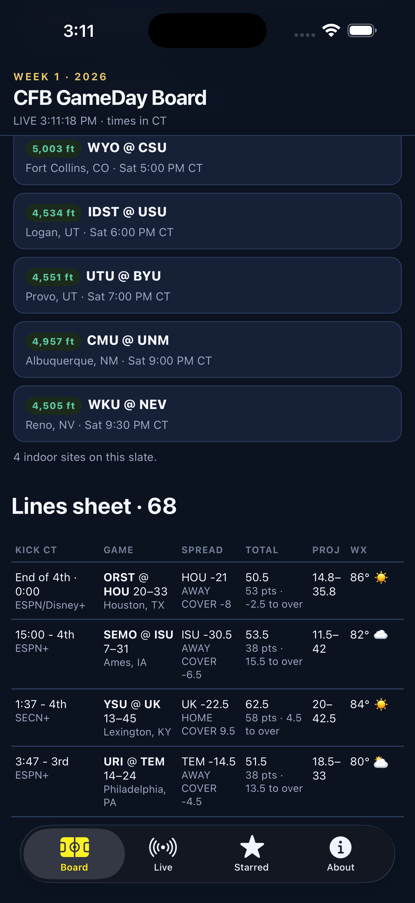

**What's interesting technically**
- **Weather at the kick hour:** Open-Meteo forecast at each stadium's coordinates with rain, wind, heat, and altitude flags and an impact read per game.
- **Snapshot discipline:** the weekly builder carries the prior line forward when the upstream feed nulls odds at kickoff, a bug found on the first live Saturday and fixed the same day.
- **Release pipeline as code:** archive, export, validate, upload, attach, and submit through the App Store Connect API from one script; the same pattern is reusable for the next iOS app.
- **Information display only:** no wagering, no sportsbook links, no accounts, no tracking.

**Built with:** `Python (stdlib)` `JavaScript` `SwiftUI` `WKWebView` `Vercel` `GitHub Actions` `Open-Meteo`

---

## LakeshoreIQ — Illinois Real Estate Intelligence
**Property search, valuation, and neighborhood intelligence over 9 live data sources**

Aggregates census demographics, school ratings (5,000+), crime statistics, transit GTFS, FEMA, FRED, and listing feeds across **150+ Illinois cities** and **50+ Chicago neighborhoods** into one analysis experience: AVM valuations with confidence scoring, rent comparables, an investment calculator, side-by-side ZIP comparison, and daily first-mover listing alerts. Exposed through a public API and a **10-tool MCP server**; 15+ backend services behind tiered Redis caching.

**Live:** [lakeshoreiq.com](https://lakeshoreiq.com)

<b>Screenshots</b>

 

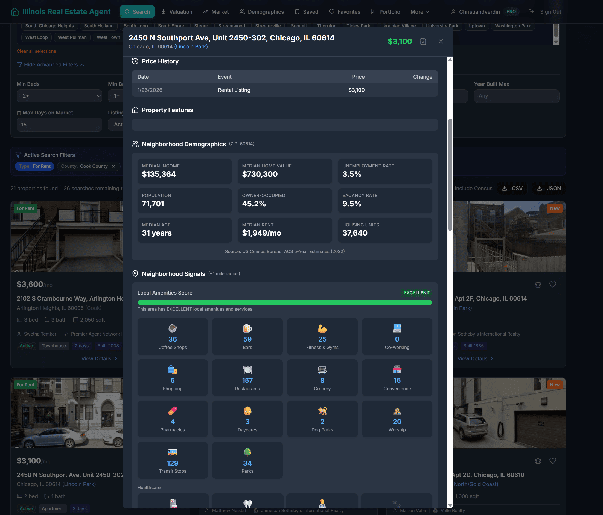

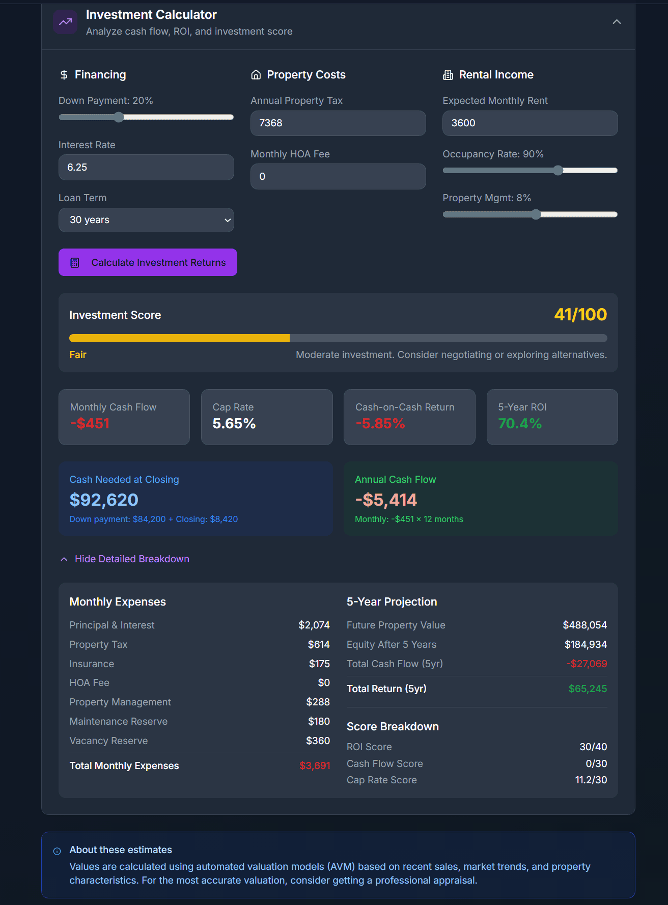

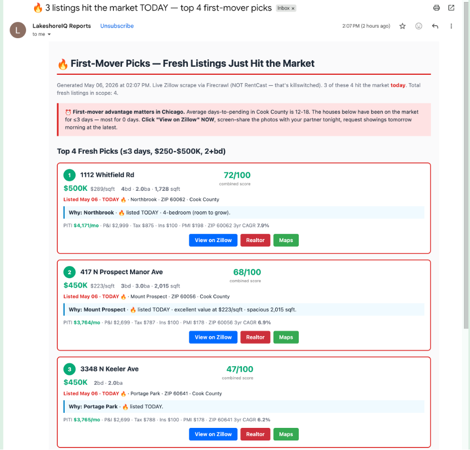

**Built with:** `Next.js` `React` `TypeScript` `FastAPI` `Python` `PostgreSQL` `Redis` `Tailwind CSS`

---

## Camera Recall — Natural-Language Q&A over Smart-Camera Events
**Certified on the Amazon Ring Appstore | metadata-only by design**

A private Ring app I built for personal use: it answers questions like "did the dog walker come today, and how long did they stay?" over my own camera event history. The architecture deliberately holds **no live-video, clip, or snapshot scopes**, so it never touches footage. **Passed Ring Appstore certification on the first submission** (Aug 2026) and a second re-validation round (Sept 2026), with a published architecture page, a reviewer demo environment, and a versioned privacy-and-legal questionnaire. Production answers are deterministic today; an LLM agent layer is staged behind re-certification, because certified answers state exactly what the system does.

**Stack:** `FastAPI` `PostgreSQL` `Railway` `300+ tests` `GitHub Actions`. Private repository.

---

## World Cup bracket tracker
**Scheduled agent automation with no servers**

A twice-daily auto-updating tracker for an AgentMail World Cup 2026 bracket: a GitHub Action pulls results through the AgentMail API, recomputes standings, and commits the refreshed page. Small on purpose: a compact, readable example of cron-style agent automation that runs entirely on GitHub infrastructure.

**Source:** [worldcup_agentcup-tracker](https://github.com/ChristianVerdin/worldcup_agentcup-tracker) · `Python` `GitHub Actions` `AgentMail`

---

## How I build

- **Production first.** Every flagship project has real users or a real platform review behind it; a demo is the starting line.
- **Measure before optimizing.** I build the tracing and evaluation layer first and let the evidence pick the re-architecture.
- **Safety as architecture.** Metadata-only scopes, least-privilege grants, copy-on-write test branches, and rollback paths are design inputs, not afterthoughts.
- **Agent-first surfaces.** Anything I build for people also gets an MCP or WebMCP surface so other agents can use it.
- **Documentation that survives handoff.** Every repo carries a `CLAUDE.md`/`CONTEXT.md` with verified state, constraints, and gotchas, written for the next engineer and for AI coding agents alike.

---

## Technical skills

**Agentic AI & LLM systems:** multi-agent supervisor/router architectures, parallel fan-out and answer composition, text-to-SQL and retrieval-grounded agents, MCP server development (cloud-deployed and local stdio), WebMCP, tool design for long-running agent operations, LLM document intelligence, prompt engineering and agent steering · Claude · GPT-4/5 · Gemini · Amazon Bedrock · Mosaic AI · LangChain/LangGraph

**LLMOps, observability & evaluation:** MLflow 3 tracing and evaluation, Langfuse, trace ETL and span/session/token analysis, ground-truth success metrics, LLM-as-judge, source-attribution checks, token cost and latency optimization, human-feedback instrumentation

**Machine learning & statistics:** LightGBM, XGBoost, CatBoost, NLP and sentiment classification, time-series forecasting, A/B testing and experimental design, causal inference, survival analysis, model calibration

**Data & platform:** Databricks (Apps, Genie, Mosaic AI agents, Unity Catalog, Lakebase, Delta Lake, serverless jobs, Asset Bundles), Spark/PySpark, PostgreSQL, Supabase, Redis, SQLite/FTS5, streaming and medallion pipelines

**Engineering & release:** Python, TypeScript/JavaScript, SQL, R, Swift/SwiftUI · React, Node/Express, FastAPI, Next.js · AWS (Bedrock, SageMaker, S3, Lambda), Cloudflare (DNS, R2), Vercel, Railway, Docker, GitHub Actions · service-principal and OAuth auth, least-privilege grant design, copy-on-write DB branching, deploy-source verification, feature-flag rollback · App Store and Ring Appstore certification

---

## Let's connect

Always open to collaborating and/or connecting. Chicago-based; remote or relocation welcome.

  <a href="https://www.linkedin.com/in/christian-verdin/">LinkedIn</a> · <a href="mailto:christiandverdin@gmail.com">christiandverdin@gmail.com</a> · <a href="https://medium.com/@cver123/about">Medium</a>

