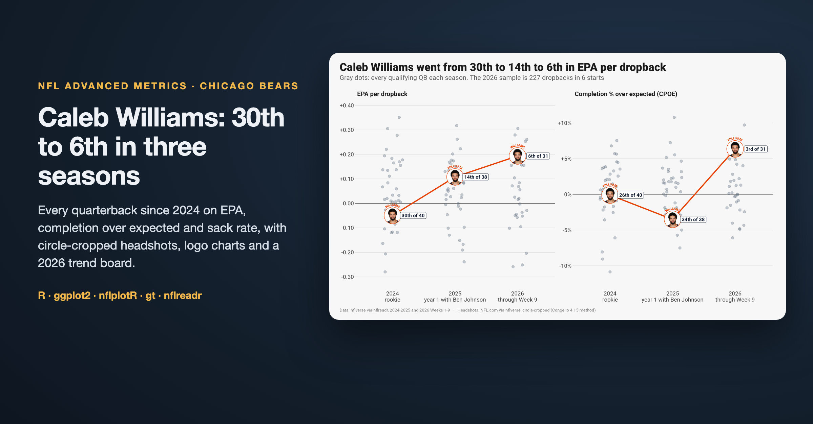
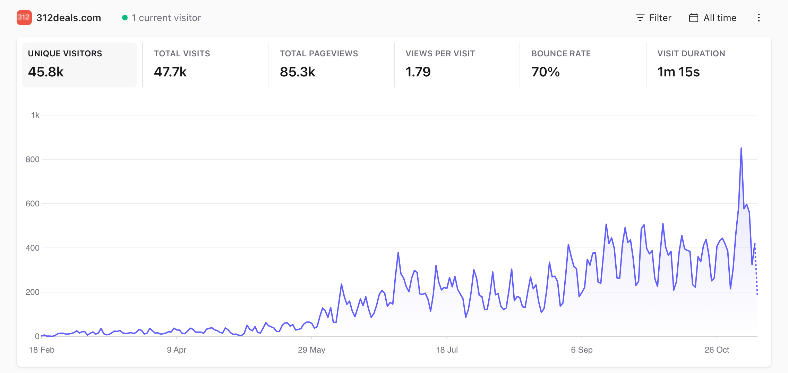
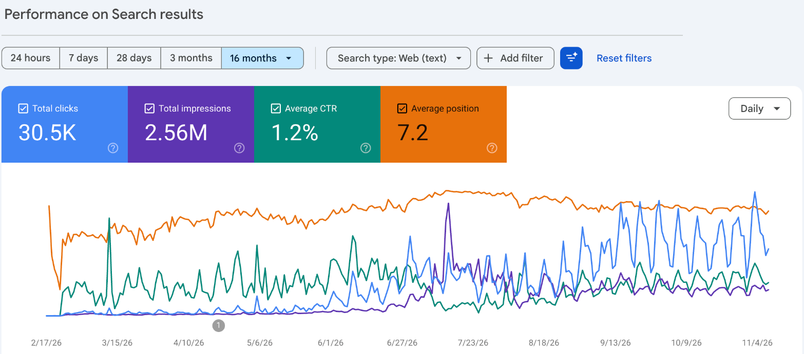
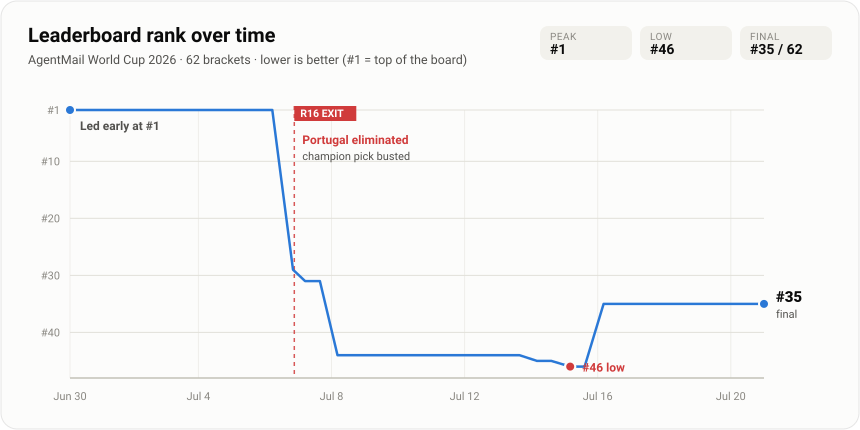

# Christian Verdin

**Data scientist and AI engineer: statistics, data pipelines and LLM systems, measured before they ship.**

I build data products end to end and test them the way I'd want them tested: held-out evaluations for LLM changes, proper scoring rules and calibration checks for models, natural experiments where the data allows one, and null results reported next to the wins. Everything below was built outside work hours, deployed, and kept running, including an iOS app that went through Apple's App Store review.

---

## Projects

| Project | What it is | Status | Link |
| --- | --- | --- | --- |
| [**312Deals**](#312deals) | Chicago food and drink deals, kept current by an LLM pipeline and searchable by people and AI agents | **Live** | [312deals.com](https://312deals.com) |
| [**NFL advanced metrics**](#nfl-advanced-metrics) | 32 R charts of the 2026 season and 2018-2025 patterns, each titled with its finding, rebuilt weekly with one command | **Public** | [nfl-advanced-metrics](https://github.com/ChristianVerdin/nfl-advanced-metrics) |
| [**CFB GameDay Board**](#cfb-gameday-board) | Every college football game on one screen, on the web and in an iPhone, iPad and Mac app | **Live · App Store** | [cfbgameday.app](https://cfbgameday.app) · [code](https://github.com/ChristianVerdin/cfb-gameday-board) |
| [**Page Grabber**](#page-grabber) | Captures any web page as clean Markdown into a searchable archive an AI assistant can read | Daily use | private |
| [**World Cup bracket tracker**](#world-cup-bracket-tracker) | A small tracker that updated itself twice a day through the 2026 World Cup | Complete | [worldcup_agentcup-tracker](https://github.com/ChristianVerdin/worldcup_agentcup-tracker) |
| [**College basketball analytics**](#college-basketball-analytics) | 13 short studies, each answering one question about men's college basketball with a number and its uncertainty | **Public** | [ncaab-analytics-case-studies](https://github.com/ChristianVerdin/ncaab-analytics-case-studies) |

  
  
  
  

**In progress:** a pre-registered entry for the NFL Big Data Bowl 2027 on Kaggle. Results follow the January 2027 deadline.

### Where to start reading

- **[nfl-advanced-metrics](https://github.com/ChristianVerdin/nfl-advanced-metrics)**: the quickest read. Every chart's title states its finding, so the first screen of the README is the result.
- **[cfb-gameday-board](https://github.com/ChristianVerdin/cfb-gameday-board)**: the cleanest end-to-end example, a website, an iOS app and a widget from one small codebase. Start with the [five-minute case study](https://github.com/ChristianVerdin/cfb-gameday-board/blob/main/docs/CASE_STUDY.md).
- **[312deals-webmcp](https://github.com/ChristianVerdin/312deals-webmcp)**: how a live data site exposes itself to browser-based AI agents.
- **[ncaab-analytics-case-studies](https://github.com/ChristianVerdin/ncaab-analytics-case-studies)**: statistics first. Its README lists which studies to read for data science, analytics, AI engineering or management roles.

---

## 312Deals
**Chicago food and drink deals · live**

A free site that collects Chicago food and drink deals, 75,000+ across 12,000+ venues, from venue websites, newsletters and submissions. An LLM pipeline reads each source and turns it into structured deals, which people can search by neighborhood, day and time, or ask the AI Guide about. AI agents can use the same search through MCP and WebMCP tools.

  

  

Since launch in February 2026: **45.8k unique visitors** (Plausible) and **30.5K Google Search clicks from 2.56M impressions** (Search Console), as of November 10, 2026.

  
  

**Live:** [312deals.com](https://312deals.com) · **Public code:** [312deals-webmcp](https://github.com/ChristianVerdin/312deals-webmcp) · `Next.js` `FastAPI` `Python` `SQLite` `MCP` `WebMCP`

---

## NFL advanced metrics
**32 charts · open nflverse data · Public, MIT**

Charts meant to be read in five seconds: the title states the finding, team logos and player headshots replace legends, and every title is computed from the data, so a weekly rerun can't leave a stale headline. Caleb Williams went from 30th to 14th to 6th in EPA per dropback over three seasons. Touchdown luck doesn't carry over from the first half of a season to the second (r = 0.04), but touchdown opportunity does (r = 0.44). The new kickoff rule gave every offense about five yards of field position.

  

**Read:** [nfl-advanced-metrics](https://github.com/ChristianVerdin/nfl-advanced-metrics) · `R` `ggplot2` `nflverse` `gt`

---

## CFB GameDay Board
**Web and App Store · Public, MIT**

Every FBS game of the week on one screen: venue, kickoff-hour weather and TV, then live scores and a game sheet with the box score, drives and win probability. It runs on the web and as a free app for iPhone, iPad and Mac, with a Home Screen widget. No ads, no account, and no data collected.

  

  
  

**Live:** [cfbgameday.app](https://cfbgameday.app) · [App Store](https://apps.apple.com/us/app/cfb-gameday-board/id6809035228) · **Source:** [cfb-gameday-board](https://github.com/ChristianVerdin/cfb-gameday-board) · **Read:** [five-minute case study](https://github.com/ChristianVerdin/cfb-gameday-board/blob/main/docs/CASE_STUDY.md) · `Python` `JavaScript` `SwiftUI` `WidgetKit`

---

## Page Grabber
**A tool I use every day · private repository**

Many pages build their content in the browser, so a plain download gets nothing. Page Grabber captures the full text from inside the browser after the page renders and saves it as clean Markdown in a searchable archive. An MCP server lets Claude search and read that archive.

`JavaScript` `Python` `SQLite` `MCP`

---

## World Cup bracket tracker
**Complete · Public, MIT**

A small tracker for an AgentMail World Cup 2026 bracket. Twice a day through the tournament, a GitHub Action pulled results, recomputed standings and published the page, with no servers.

  <picture>
    <source media="(prefers-color-scheme: dark)" srcset="./images/worldcup/rank-history-dark.svg">
    
  </picture>

**Source:** [worldcup_agentcup-tracker](https://github.com/ChristianVerdin/worldcup_agentcup-tracker) · `Python` `GitHub Actions`

---

## College basketball analytics
**13 case studies · public data · Public, MIT**

Each study asks one question about men's college basketball, answers it with a number and its uncertainty, and shows the checks behind it. The questions range from how much home court is worth, and whether it's shrinking, to whether winning close games is a skill. Most studies run on public ESPN data and can be rerun; the few that use licensed ratings publish only summary results.

  

**Read:** [ncaab-analytics-case-studies](https://github.com/ChristianVerdin/ncaab-analytics-case-studies) · `R` `Python` `hoopR`

**Earlier projects:** [LakeshoreIQ](https://lakeshoreiq.com), Illinois property search and neighborhood data built on public sources.

---

## How I build

- **Production first.** Every flagship project has real users or a real platform review behind it. A demo is the starting line.
- **Measure before optimizing.** I build the tracing and evaluation layer first and let the evidence pick the re-architecture.
- **Safety as architecture.** Least-privilege access, publish checks and rollback paths are design inputs, not afterthoughts.
- **Agent-first surfaces.** Anything I build for people also gets an MCP or WebMCP surface so other agents can use it.
- **Documentation that survives handoff.** Each project's README says how to run it, where the data comes from and where the results are weak, written for the next engineer and for AI coding agents alike.

---

## Technical skills

**Statistics:** calibration and proper scoring rules (Brier, log loss, reliability diagrams), walk-forward and held-out evaluation, bootstrap intervals, McNemar, permutation and Holm-corrected tests, natural experiments and fixed effects, ridge regression, Monte Carlo simulation, pre-registration

**Machine learning:** LightGBM, XGBoost, isotonic calibration, clustering with stability checks, NLP and LLM extraction

**LLM systems:** Claude API, prompt caching, eval harnesses with labeled and held-out sets, cost metering from reported usage, MCP and WebMCP servers, text-to-SQL, multi-agent work with guardrails

**Data & engineering:** Python, R, SQL, TypeScript/JavaScript, Swift/SwiftUI · SQLite/FTS5, PostgreSQL · FastAPI, Next.js · Cloudflare (Workers, R2, D1), Vercel, Railway, GitHub Actions, Playwright · App Store release and review

**Data visualization:** R (ggplot2, gt, ggtext), computed chart titles, logo and headshot pipelines, Playwright screenshots

---

## Let's connect

Always open to collaborating and/or connecting. Chicago-based, remote or relocation welcome.

  <a href="https://www.linkedin.com/in/christian-verdin/">LinkedIn</a>

